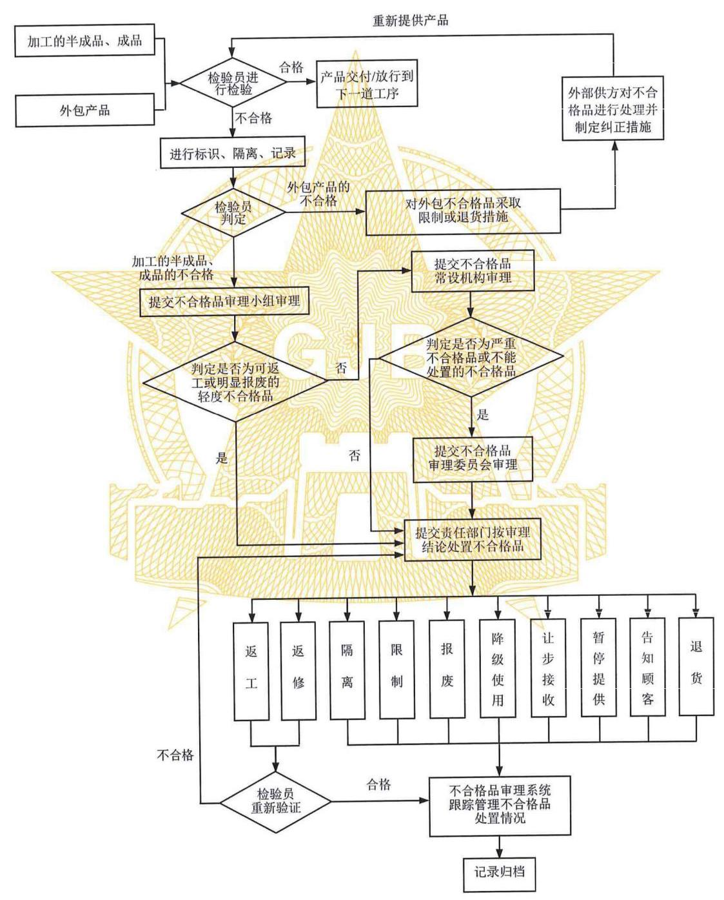

中华人民共和国国家军用标准

FL 0106 GJB 571A-2024

代替 GJB 571-1988

# 不合格品管理 Management for nonconforming product

2025-01-07 发布 2025-03-01 实施

中央军委装备发展部 颁 布

## 前言

本标准代替 GJB 571-1988 《不合格品管理》。

本标准与 GJB 571-1988 相比, 主要有下列变化:

a)适用范围扩大到研制、生产、交付使用阶段，并明确了本标准不适用于军用软件产品；

b)标准结构修改为一般要求和详细要求；

c) 增加了不合格品审理系统的主要工作内容、审理及处置、标识与隔离、外包产品的不合格管理以及纠正措施的监督管理等要求。

本标准附录 A、附录 B 是资料性附录。

本标准由军委装备发展部合同监管局提出。

本标准起草单位:中国航空综合技术研究所、沈阳飞机工业(集团)有限公司、中国空空导弹研究院、 中国船舶重工集团公司第七一五研究所、空军装备部驻沈阳地区第一军事代表室、中国航天标准化研究所。

本标准主要起草人:梁昭磊、姜延榉、柳响亮、李彬、王婉青、白殿林、王 婕、常 乐、 王英杰、高 洋、王晓亮、陈雪晴。

GJB 571 于 1988 年 12 月首次发布。

## 不合格品管理

## 1 范围

本标准规定了不合格品管理的一般要求和详细要求。

本标准适用于军工产品的试制和生产过程中产生的不合格品的管理。也适用于在产品交付或开始使用后发现的不合格品以及外包产品产生的不合格品的管理。

本标准不适用于军用软件产品的管理。

## 2 引用文件

下列文件中的有关条款通过引用而成为本标准的条款。凡注日期或版次的引用文件，其后的任何修改单(不包含勘误的内容) 或修订版本都不适用于本标准, 但提倡使用本标准的各方探讨使用其最新版本的可能性。凡不注日期或版次的引用文件，其最新版本适用于本标准。

GB/T 19000 质量管理体系基础和术语

GJB 1405 装备质量管理术语

## 3 术语和定义

GB/T 19000、GJB 1405 确立的以及下列术语和定义适用于本标准。

### 3.1 不合格品 nonconforming product

不符合、未满足要求的产品。

### 3.2 严重不合格品 major nonconforming product

凡下列因素之一不能满足规定要求并可能造成严重后果的不合格。

a)功能特性、使用特性;

b) 功能接口或物理接口;

c)互换性;

d)形状、重量、重心;

e)可靠性、维修性、测试性、保障性、安全性;

f) 环境适应性和电磁兼容性等特性;

g)影响人员健康与安全；

h)其他。

### 3.3 轻度不合格品 minor nonconforming product

严重不合格品以外的不合格品为轻度不合格品。

### 3.4 限制 restricts

限定不合格品的使用范围，避免其非预期使用。

## 4 一般要求

4.1 组织应制定不合格品管理程序，规定不合格品控制、处置的有关职责和权限，明确不合格品隔离、 标识、记录、审理和处置的要求。

4.2 组织应根据实际情况建立不合格品的审理系统, 审理系统一般由不合格品审理委员会、不合格品审理常设机构和不合格品审理小组(或人员)组成。不合格品的审理与处置流程参见附录 A。

4.3 不合格品审理系统应由设计、工艺、质量、生产、采购等有关部门相对固定的人员组成。不合格品审理常设机构一般设置在质量部门或技术部门。

4.4 组织应确定不合格品审理人员的资格、能力和培训要求，对其进行资格确认并确定审理范围，由最高管理者授权，并征得顾客或其代表的同意。

4.5 组织应按不合格品审理系统的职责，对不合格品进行分级分类审理，并保证其独立行使职权。如果要改变其审理结论时, 应由最高管理者签署书面决定并存档备查。对顾客或其代表关注的不合格品审理结论更改，应征得顾客或其代表同意。

4.6 不合格品的审理结论, 仅对当时被审理的不合格品有效, 不应作为以后审理不合格品或验收其他同类产品的依据，也不能影响顾客或其代表对产品的判定。当相同不合格再次发生时，应再次审理。

4.7 对于未经顾客或其代表授权的让步使用, 应征得顾客或其代表同意; 关键特性不允许让步使用。

4.8 经返工或返修处置的不合格品应重新进行验证, 以证实其满足规定的要求或使用要求, 并保留相关记录。

4.9 组织应分析不合格品产生的影响，采取必要的措施遏制不合格对其他过程、产品的影响，并查明原因、分清责任、落实纠正措施，防止不合格品重复发生。

4. 10 组织应建立不合格品审理台账，收集、整理、保持/保留不合格品的有关文件及记录，按策划的时间间隔对不合格品的原因进行统计分析，采取纠正措施。

4. 11 组织应在对不合格品质量损失统计、分析的基础上，采取针对性的改进措施。

4. 12 组织在发现产品不合格时, 应采取与不合格的影响或潜在影响的程度相适应的措施, 消除或减少所造成的影响。其中, 在产品交付或开始使用后发现产品不合格时, 组织应告知顾客, 以便顾客了解不合格品的性质和影响程度, 可根据需要采取现场更换或修理、返厂修理、召回、报废等措施, 对不合格品进行处理。

## 5 详细要求

### 5.1 不合格品的处置方式

不合格品的处置方式一般包括:

a) 返工;

b) 返修;

c) 报废；

d) 让步接收;

e) 降级使用;

f) 退货;

g)隔离；

h)限制;

i) 暂停提供;

j)告知顾客。

### 5.2 不合格品审理系统的主要工作内容

5.2.1 不合格品审理小组(或人员)应由经授权的人员组成，其主要工作内容包括:

a)负责审理并处置可返工或明显报废的轻度不合格品；

b) 负责将除可返工或明显报废的轻度不合格品以外的不合格品提交常设机构进行审理;

c)负责监督所处置的不合格品纠正或纠正措施的落实情况；

d)负责管辖范围内不合格品的统计、上报工作。

5.2.2 不合格品审理常设机构应由经授权的人员组成，其主要工作内容包括:

a)负责审理由审理小组(或人员)提交的不合格品；

b)负责将严重不合格品或不能处置的不合格品提交审理委员会进行审理；

c)履行审理委员会日常办事机构的职能，对委员会提出的处置意见组织实施；

d)归口不合格品管理工作并组织对纠正措施的制定与实施进行监督；

e) 负责组织不合格品的统计与分析工作;

f)负责组织建立不合格品审理台账；

g)负责涉及不合格品的事项与顾客或其代表沟通。

5.2.3 不合格品审理委员会应由经授权的人员组成，其主要工作内容是:

a) 负责审理严重不合格品；

b)负责审理由常设机构提交的不合格品；

c)负责对严重不合格品所制定的纠正与纠正措施进行审查。

注 1:必要时，可邀请顾客或其代表参加评审，但其不属于审理委员会的成员。

注 2:必要时，不合格品审理委员会可吸收相关专业人员组成专题审理小组，对不合格品进行专题审理。不合格品审理系统可根据组织的规模和复杂程度，也可将不合格品审理委员会与常设机构进行合并管理。

### 5.3 不合格品标识、隔离

5.3.1 当发现不合格品时，组织应进行标识，并及时采取隔离或控制措施，防止非预期的使用或交付。 当隔离不可实行时, 应采取有效控制措施, 防止与合格品混淆。不合格品的处置结果也要做出相应的标识。

5.3.2 不合格品标识可直接制作在产品上，当不能直接在不合格品(如规格尺寸小、制作标识可能影响其特性或寿命等)上制作标识时, 允许在包装物或适当的载体上(如标签、标牌、套管等)进行标识。也可以利用流程卡、产品质量证明文件或其他记录等方式进行标识，并随不合格品一起流转。

5.3.3 对废品，组织应采用破坏性或非破坏性的方式做出明显的和永久的标识，直至在物理上不可能再被使用，并加以隔离，防止误用。当采用非破坏性方式标识时，标识应醒目且不易消失。

5.3.4 对让步接收的不合格品，除在产品上做出相应的标识外，必要时还应对其进行编号，在流程卡上注明其去向, 并在产品质量证明文件上加以标注。

### 5.4 不合格品审理及处置

5.4.1 检验人员在发现不合格品时，应做好以下工作:

a)填写《不合格品通知/审理单》(参见附录 B)相关内容，并加盖检验员印章；

b)将《不合格品通知/审理单》送交不合格品审理小组(或人员)处置。

5.4.2 不合格品审理小组(或人员)对可返工或明显报废的轻度不合格品，可直接填写审理意见，签字后送交责任部门组织实施。否则，提交不合格品审理常设机构处置。

5.4.3 不合格品审理常设机构在接到《不合格品通知/审理单》后，按工作分工组织有关人员进行审理， 提出并填写审理意见后提交责任部门组织实施。否则，提交不合格品审理委员会处置。

5.4.4 不合格品审理委员会负责对不合格品审理常设机构提交的《不合格品通知/审理单》进行审理, 填写处置意见后提交责任部门组织实施。

5.4.5 涉及让步接收的不合格品，应经组织中负责设计的授权代表或由设计组织的授权人员审批；如果不合格导致偏离合同要求，应由顾客或其代表审批。

5.4.6 责任部门在收到《不合格品通知/审理单》后，应按审理结论处置不合格品，并组织对正在加工的同一图(代)号/同批原材料的产品采取措施，以防止不合格品的继续发生。经不合格品审理委员会确定需要追回的不合格品, 应书面通知有关单位、顾客或其代表。

5.4.7 检验人员对经返工或返修处置的不合格品应进行重新验证，确认其满足规定的要求或使用要求后, 在《不合格品通知/审理单》填写验证结果, 并保留验证的记录。

### 5.5 外包产品的不合格管理

5.5.1 当外包产品出现因外部供方原因所致的不合格时，组织可采取限制或退货的处置方式进行不合格品处理；如需让步使用时，组织应办理相应的审批手续。同时，组织应将外包产品的不合格情况通知外部供方，要求外部供方采取纠正和纠正措施，并评价供方纠正措施的有效性。

5.5.2 外部供方接到产品不合格情况通知后，应对不合格品进行处理并制定纠正措施，避免其再次发生或者在其他场合发生。

### 5.6 纠正措施的监督管理

5.6.1 责任部门在按审理结论完成不合格品处置后，应从人、机、料、法、环、测等方面，找出不合格产生的根本原因，制定纠正措施并实施，避免其再次发生或者在其他场合发生。纠正措施应与不合格所产生的影响相适应。

5.6.2 责任部门所制定的纠正措施应经审批，并由不合格品审理系统进行跟踪管理，监督其实施情况。

5.6.3 不合格品审理常设机构应按策划的时间间隔对不合格品审理台账中记录的信息进行统计和分析，形成不合格品统计分析报告，作为分析和评价产品质量、质量管理体系运行情况以及降低内、外部质量损失的依据，并采取针对性的改进措施。

### 5.7 不合格品的记录

5.7.1 组织应建立并保留不合格品审理有关记录，包括:

a) 《不合格品通知/审理单》;

b) 对不合格原因分析和采取措施的记录;

c) 让步接收、告知顾客、暂停提供等的记录;

d) 不合格返工、返修以后再次验证的结果记录;

e) 审理人员的信息;

f)组织认为需要建立和保留的其他不合格品审理有关记录。

5.7.2 不合格品审理有关记录的保留期限应与产品的寿命周期相适应, 并保持其可追溯。

5.7.3 必要时，组织应建立不合格品审理有关记录的数据库。

## 附录 A (资料性附录) 不合格品审理与处置流程

不合格品审理与处置流程见图 A.1。

图 A. 1 不合格品审理与处置流程图

## 附录B (资料性附录) 不合格品通知/审理单

B. 1 组织应根据实际需要确定《不合格品通知/审理单》的份数和保存期限。

B. 2 《不合格品通知/审理单》格式见图 B.1。

编号:

<table><tr><td>型号</td><td></td><td>研制阶段</td><td></td><td>产品(或零部件)名称</td><td></td></tr><tr><td>批架次</td><td></td><td>配套对象</td><td></td><td>产品图(代)号</td><td></td></tr><tr><td>工序号</td><td></td><td>送检数</td><td></td><td>不合格品编号</td><td></td></tr><tr><td>责任部门</td><td></td><td>操作者</td><td></td><td>不合格品数量</td><td></td></tr><tr><td colspan="6">不合格品情况描述:   检验员:年月日</td></tr><tr><td colspan="6">审理意见:   (签名):年月日</td></tr><tr><td colspan="6">设计部门授权人员(或单位负责设计的授权代表)意见:   (签名):年月日</td></tr><tr><td colspan="6">顾客或其代表意见:   (签名):年月日</td></tr><tr><td colspan="6">返工、返修复验结果:   检验员:年月日</td></tr></table>

注 1:审理意见应按不同的审理等级由经授权的不合格品审理人员给出审理意见。审理意见中应包含当时被审理的不合格品的处置要求、追溯要求。

注 2:涉及让步接收的不合格品，应经组织中负责设计的授权代表或由设计组织的授权人员审批；如果不合格导致偏离合同要求，应由顾客或其代表审批。

注 3:组织可根据实际对表格进行调整，但应确保本表格的主要信息可追溯；若《不合格品通知/审理单》内容较多时，可另加附页。

图 B. 1 不合格品通知/审理单格式

GJB 571A-2024

中华人民共和国

国家军用标准

不合格品管理

GJB 571A-2024

*

国家军用标准出版发行部出版

(北京东外京顺路 7 号)

国家军用标准出版发行部印刷车间印刷

国家军用标准出版发行部发行

版权专有 不得翻印

*

开本 \( {880} \times  {1230}\;1/{16} \) 印张 \( \% \) 字数 19 千字

2025 年 2 月第 1 版 2025 年 2 月第 1 次印刷

军标出字第 16537 号