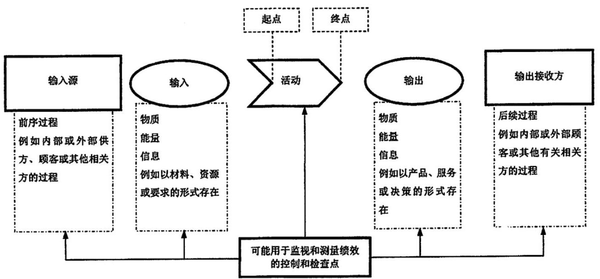
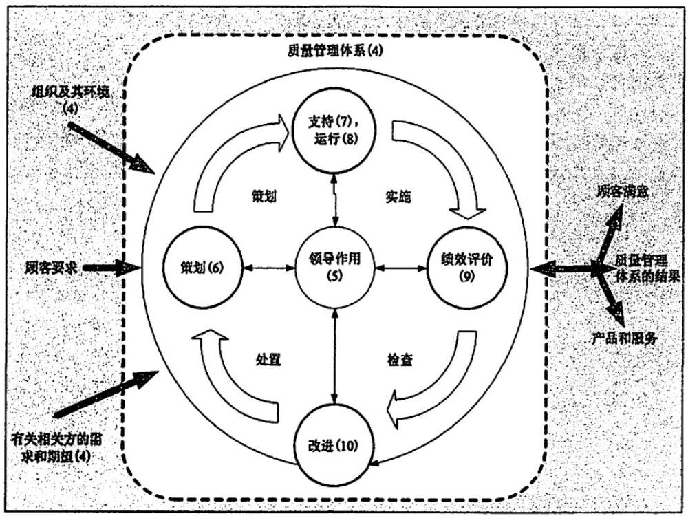

中华人民共和国国家军用标准

FL 0106

GJB 9001C-2017

代替 GJB 9001B-2009

# 质量管理体系要求 Quality management systems requirements

2017-05-18 发布 2017-07-01 实施

中央军委装备发展部 颁布

## 目 次

前言 IV

引言 V

1 范围 1

2 规范性引用文件 1

3 术语和定义 2

4 组织环境 2

4.1 理解组织及其环境 2

4.2 理解相关方的需求和期望 2

4.3 确定质量管理体系的范围 2

4.4 质量管理体系及其过程 3

5 领导作用 3

5.1 领导作用和承诺 3

5.1.1 总则 3

5.1.2 以顾客为关注焦点 4

5.2 方针 4

5.2.1 制定质量方针 4

5.2.2 沟通质量方针 4

5.3 组织的岗位、职责和权限 4

6 策划 5

6.1 应对风险和机遇的措施 5

6.2 质量目标及其实现的策划 5

6.3 变更的策划 5

7 支持 6

7.1 资源 6

7.1.1 总则 6

7.1.2 人员 6

7.1.3 基础设施 6

7.1.4 过程运行环境 6

7.1.5 监视和测量资源 6

7.1.6 组织的知识 7

7.2 能力 7

7.3 意识 7

7.4 沟通 8

7.5 成文信息 8

7.5.1 总则 8

7.5.2 创建和更新 8

7.5.3 成文信息的控制 8

7.6 质量信息 9

8 运行 9

8.1 运行的策划和控制 9

8.2 产品和服务的要求 10

8.2.1 顾客沟通 10

8.2.2 产品和服务要求的确定 10

8.2.3 产品和服务要求的评审 10

8.2.4 产品和服务要求的更改 11

8.3 产品和服务的设计和开发 11

8.3.1 总则 11

8.3.2 设计和开发策划 11

8.3.3 设计和开发输入 12

8.3.4 设计和开发控制 12

8.3.5 设计和开发输出 13

8.3.6 设计和开发更改 13

8.3.7 新产品试制 13

8.3.8 设计和开发的试验控制 13

8.4 外部提供的过程、产品和服务的控制 14

8.4.1 总则 14

8.4.2 控制类型和程度 14

8.4.3 提供给外部供方的信息 15

8.5 生产和服务提供 15

8.5.1 生产和服务提供的控制 15

8.5.2 标识和可追溯性 16

8.5.3 顾客或外部供方的财产 16

8.5 .4 防护 16

8.5.5 交付后的活动 16

8.5.6 更改控制 17

8.5.7 关键过程 17

8.6 产品和服务的放行 17

8.7 不合格输出的控制 17

9 绩效评价 18

9.1 监视、测量、分析和评价 18

9.1.1 总则 18

9.1.2 顾客满意 18

9.1.3 分析与评价 18

9.2 内部审核 19

9.3 管理评审 19

9.3.1 总则 19

9.3.2 管理评审输入 19

9.3.3 管理评审输出 20

10 改进 20

10.1 总则 20

10.2 不合格和纠正措施 20

10.3 持续改进 21

附 录 A (资料性附录) 新结构、术语和概念说明 22

附录 B(资料性附录)GB/T 19000《质量管理体系 基础和术语》中的质量管理原则. 25

附 录 C (资料性附录) 相关国家军用标准 30

## 前 言

本标准代替GJB 9001B-2009《质量管理体系要求》，是在等同采用GB/T 19001-2016 (ISO 9001: 2015) 的基础上增加装备质量管理体系特殊要求编制而成, 将装备质量管理体系的特殊要求作为标准的一部分 (B部分), 列在GB/T 19001-2016标准 (A部分) 相应条款之后, 独立成条并作为该条款的补充, 对引言中部分描述内容进行了具体化，对附录进行了调整。

为便于识别，本标准采用国家标准的内容(A部分)以宋体字表述，增加的特殊要求(B部分)以楷体字表述。

本标准为承担军队装备及配套产品论证、研制、生产、试验、维修和服务任务的组织规定了质量管理体系要求，并为实施质量管理体系评定提供了依据。

本标准的附录A、附录B和附录C是资料性附录。

本标准由中央军委装备发展部合同监管局提出。

本标准起草单位:中国新时代认证中心、技术基础管理中心、陆军北京军事代表局、军械工程学院、 海军装备研究院舰船论证研究所、海军驻天津地区军事代表局、空军驻北京地区军事代表局、火箭军装备部试验监管局、赛宝认证中心、中国航天科技集团公司第七O八研究所、中国电子科技集团公司第十五研究所。

本标准主要起草人:程旭辉、王树海、王江山、刘世济、夏海光、刘连才、刘希凤、冀 林、李跃生、马绍力、于永利、马 力、吕恩长、侯志强、蔡 戬、刘金刚。

本标准所代替标准的历次版本发布情况为:GJB/Z 9001-1996、GJB/Z 9002-1996、GJB/Z 9003-1996、 GJB 9001A-2001、GJB 9001A-2009。

## 引 言

### 0.1 总则

采用质量管理体系是组织的一项战略性决策，能够帮助其提高整体绩效，为推动可持续发展奠定良好基础。

组织根据本标准实施质量管理体系的潜在益处是:

a)稳定提供满足顾客要求以及适用的法律法规要求的产品和服务的能力;

b)促成增强顾客满意的机会；

c)应对与组织环境和目标相关的风险和机遇；

d) 证实符合规定的质量管理体系要求的能力;

e) 证实具备承担装备建设相关任务的能力。

本标准可用于内部和外部各方。

实施本标准并非需要:

——统一不同质量管理体系的架构；

——形成与本标准条款结构相一致的文件；

——在组织内使用本标准的特定术语。

本标准规定的质量管理体系要求是对产品和服务要求的补充。

本标准采用过程方法，该方法结合了“策划一实施一检查一处罝”(PDCA)循环和基于风险的思维。

过程方法使组织能够策划过程及其相互作用。

PDCA循环使组织能够确保其过程得到充分的资源和管理，确定改进机会并采取行动。

基于风险的思维使组织能够确定可能导致其过程和质量管理体系偏离策划结果的各种因素, 采取预防控制, 最大限度地降低不利影响, 并最大限度地利用出现的机遇 (见A. 4)。

在日益复杂的动态环境中持续满足要求，并针对未来需求和期望采取适当行动，这无疑是组织面临的一项挑战。为了实现这一目标, 组织可能会发现, 除了纠正和持续改进, 还有必要采取各种形式的改进, 如突破性变革、创新和重组。

在本标准中使用如下助动词:

——“应”表示要求；

——“宜”表示建议；

——“可”表示允许；

——“能”表示可能或能够。

“注”的内容是理解和说明有关要求的指南。

### 0.2 质量管理原则

本标准是在GB/T 19000所阐述的质量管理原则基础上制定的。每项原则的介绍均包含概述、该原则对组织的重要性的依据、应用该原则的主要益处示例以及应用该原则提高组织绩效的典型措施示例。

质量管理原则是:

——以顾客为关注焦点；

——领导作用；

——全员积极参与；

——过程方法；

——改进；

——循证决策；

——关系管理。

### 0.3 过程方法

#### 0.3.1 总则

本标准倡导在建立、实施质量管理体系以及提高其有效性时采用过程方法, 通过满足顾客要求增强顾客满意。采用过程方法所需考虑的具体要求见 4.4 。

将相互关联的过程作为一个体系加以理解和管理, 有助于组织有效和高效地实现其预期结果。这 种方法使组织能够对其体系的过程之间相互关联和相互依赖的关系进行有效控制，以提高组织整体绩效。

过程方法包括按照组织的质量方针和战略方向, 对各过程及其相互作用进行系统的规定和管理, 从而实现预期结果。可通过采用PDCA循环(见0.3.2)以及始终基于风险的思维(见0.3.3)对过程和整个体系进行管理, 旨在有效利用机遇并防止发生不良结果。

在质量管理体系中应用过程方法能够:

a)理解并持续满足要求;

b)从增值的角度考虑过程;

c) 获得有效的过程绩效;

d)在评价数据和信息的基础上改进过程。

单一过程的各要素及其相互作用如图1所示。每一过程均有特定的监视和测量检查点以用于控制, 这些检查点根据相关的风险有所不同。

图1 单一过程要素示意图

#### 0.3.2 PDCA循环

PDCA循环能够应用于所有过程以及整个质量管理体系。图2表明了本标准第4章至第10章是如何构成 PDCA循环的。

PDCA循环可以简要描述如下:

——策划 (Plan):根据顾客的要求和组织的方针，建立体系的目标及其过程，确定实现结果所需的资源，并识别和应对风险和机遇；

——实施 (Do) :执行所做的策划；

——检查 (Check):根据方针、目标、要求和所策划的活动，对过程以及形成的产品和服务进行监视和测量(适用时), 并报告结果;

——处置 (Act):必要时，采取措施提高绩效。

#### 0.3.3 基于风险的思维

基于风险的思维 (见A. 4) 是实现质量管理体系有效性的基础。本标准以前的版本已经隐含基于风险思维的概念, 例如: 采取预防措施消除潜在的不合格, 对发生的不合格进行分析, 并采取与不合格的影响相适应的措施，防止其再发生。

为满足本标准的要求, 组织需策划和实施应对风险和机遇的措施。应对风险和机遇, 为提高质量管理体系有效性、获得改进结果以及防止不利影响奠定基础。

某些有利于实现预期结果的情况可能导致机遇的出现, 例如: 有利于组织吸引顾客、开发新产品和服务、减少浪费或提高生产率的一系列情形。利用机遇所采取的措施也可能包括考虑相关风险。风险是不确定性的影响, 不确定性可能有正面的影响, 也可能有负面的影响。风险的正面影响可能提供机遇, 但并非所有的正面影响均可提供机遇。

注:括号中的数字表示本标准的相应章。

图2 本标准的结构在PDCA 循环中的展示

### 0.4 与其他管理体系标准的关系

本标准采用ISO制定的管理体系标准框架，以提高与其他管理体系标准的协调一致性(见A. 1)。

本标准使组织能够使用过程方法，并结合PDCA循环和基于风险的思维，将其质量管理体系与其他管理体系标准要求进行协调或一体化。

本标准 (A部分) 与GB/T 19000和GB/T 19004存在如下关系:

——GB/T 19000《质童管理体系基础和术语》为正确理解和实施本标准提供必要基础；

——GB/T 19004《追求组织的持续成功质量管理方法》为选择超出本标准要求的组织提供指南。本标准 (A部分) 不包括针对环境管理、职业健康和安全管理或财务管理等其他管理体系的特定要求。

在本标准(A部分)的基础上，已经制定了若干行业特定要求的质量管理体系标准。其中的某些标准规定了质量管理体系的附加要求, 而另一些标准则仅限于提供在特定行业应用本标准的指南。

本标准(A部分)的章条内容与之前版本(GB/T 19001-2008/ISO 9001: 2008)章条内容之间的对应关系见ISO/TC176/SC2(国际标准化组织/质量管理和质量保证技术委员会/质量体系分委员会)的公开网站: www.iso.org/tc176/sc02/public。

### 0.5 本标准装备特殊要求的考虑

本标准在等同采用国家标准GB/T 19001-2016的基础上增加装备质量管理体系的特殊要求(B部分)， 这样做的重要意义在于:

a)坚持质量至上，突出满足作战使用需求和实战化运用要求。装备使用基于严酷的作战环境，其质量关乎战争胜负、关乎官兵生命，质量管理体系特殊要求突出装备的可靠性、维修性、保障性、 测试性、安全性和环境适应性等通用质量特性要求; 突出标准化、软件工程化、技术状态管理等控制要求；突出新产品试制、试验和关键过程控制的要求；突出装备交付后的维修、保障和质量事故处理要求。

b)贯彻军民融合国家战略，突出军品必为精品的要求. 引导组织在构建质量管理体系时，首先应满足国家标准要求，在此基拙上，满足装备的特殊要求，促进其产品和服务的质量管理体系过程军民通用，提升质量管理体系能力和水平，降低组织的管理成本。

c)保持科学性、针对性和前瞻性，提高可操作性。本标准试图将国家标准中较为通用的要求具体化， 较为宽泛的选择更具针对性, 引导组织建立装备质量管理体系并更具适用性; 基于风险管理先进理念，合理提出质量管理体系特殊要求，满足当前和未来信息化体系建设要求。

## 质量管理体系要求

## 1 范围

本标准为下列组织规定了质量管理体系要求:

a)需要证实其具有稳定提供满足顾客要求及适用法律法规要求的产品和服务的能力；

b)通过体系的有效应用，包括体系改进的过程，以及保证符合顾客要求和适用的法律法规要求，旨在增强顾客满意。

本标准规定的所有要求是通用的, 旨在适用于各种类型、不同规模和提供不同产品和服务的组织。

本标准适用于承担军队装备及配套产品论证、研制、生产、试验、维修和服务任务的组织，提供其他军用产品和服务的组织可参照使用。

注1:在本标准中的术语“产品”或“服务”仅适用于预期提供给顾客或顾客所要求的产品和服务。

注2:法律法规要求可称作为法定要求。

注3:本标准中的组织是指各类军队装备的承制单位。

注4:本标准中的顾客是指产品和服务的接受者，包括军队装备机关、军事代表机构、项目管理机构、装备使用部队， 以及供应链中的订购方。

## 2 规范性引用文件

下列文件对于本文件的应用是必不可少的。凡是注日期的引用文件，仅注日期的版本适用于本文件。 凡是不注日期的引用文件，其最新版本(包括所有的修改单)适用于本文件。

GB/T 19000一2016质量管理体系基础和术语

GJB 190 特性分类

GJB 368 装备维修性工作通用要求

GJB 450 装备可靠性工作通用要求

GJB 451 可靠性维修性保障性术语

GJB 571 不合格品管理

GJB 841 故障报告、分析和纠正措施系统

GJB 900 装备安全性工作通用要求

GJB 907 产品质量评审

GJB 908 首件鉴定

GJB 909 关键件和重要件的质量控制

GJB 1269 工艺评审

GJB 1362 军工产品定型程序和要求

GJB 1405 装备质量管理术语

GJB 1710 试制和生产准备状态检查

GJB 1909 装备可靠性维修性保障性要求论证

GJB 2547 装备测试性工作通用要求

GJB 2786 军用软件开发通用要求

GJB 3206 技术状态管理

GJB 3872 装备综合保障通用要求

GJB 4239 装备环境工程通用要求

GJB 5000 军用软件研制能力成熟度模型

GJB 6600 装备交互式电子技术手册

GJB 8000 军用软件研制能力等级要求

注:组织在引用上述国家军用标准时，需要考虑其适用性，以避免其过使用或欠使用。

## 3 术语和定义

GB/T 19000-2016界定的术语和定义适用于本文件。

本标准装备特殊要求采用GJB 1405、GJB 451中所界定的术语和定义。

## 4 组织环境

### 4.1 理解组织及其环境

组织应确定与其宗旨和战略方向相关并影响其实现质量管理体系预期结果的能力的各种外部和内部因素。

组织应确定与所承担装备任务相关的法律法规、标准、使用需求、保障条件等影响因素。

组织应对这些外部和内部因素的相关信息进行监视和评审。

注1:这些因素可能包括需要考虑的正面和负面要素或条件。

注2:考虑来自于国际、国内、地区和当地的各种法律法规、技术、竞争、市场、文化、社会和经济环境的因素，有助于理解外部环境。

注3:考虑与组织的价值观、文化、知识和绩效等有关的因素，有助于理解内部环境。

### 4.2 理解相关方的需求和期望

由于相关方对组织稳定提供符合顾客要求及适用法律法规要求的产品和服务的能力具有影响或潜在影响，因此，组织应确定:

a)与质量管理体系有关的相关方；

b)与质量管理体系有关的相关方的要求。

组织应监视和评审这些相关方的信息及其相关要求。

注:承担装备任务组织的相关方，主要包括:组织的所有者、顾客、外部供方(如:元器件、原材料、零部件供方， 工序协作方，工程承包方)、合作伙伴(如:新产品合作开发方)，组织内的员工，相对独立的资质认可、检验检测机构，以及竞争对手等。

### 4.3 确定质量管理体系的范围

组织应确定质量管理体系的边界和适用性，以确定其范围。

在确定范围时, 组织应考虑:

a) 4.1中提及的各种外部和内部因素;

b) 4.2中提及的相关方的要求;

c) 组织的产品和服务。

如果本标准的全部要求适用于组织确定的质量管理体系范围，组织应实施本标准的全部要求。

组织的质量管理体系范围应作为成文信息，可获得并得到保持。该范围应描述所覆盖的产品和服务类型, 如果组织确定本标准的某些要求不适用于其质量管理体系范围, 应说明理由。

只有当所确定的不适用的要求不影响组织确保其产品和服务合格的能力或责任，对增强顾客满意也不会产生影响时，方可声称符合本标准的要求。

当组织删减本标准的要求时，应征得顾客同意。

注:本标准中的成文信息，是指需要控制和保持的信息及其载体。其中，保持的成文信息是指文件(质量手册、程序文件，产品规范、设计图样等)，保留的成文信息是指记录(检验记录、试验报告等)。

### 4.4 质量管理体系及其过程

4.4.1 组织应按照本标准的要求，建立、实施、保持和持续改进质量管理体系，包括所需过程及其相互作用。

组织应确定质量管理体系所需的过程及其在整个组织中的应用，且应:

a)确定这些过程所需的输入和期望的输出；

b)确定这些过程的顺序和相互作用；

c)确定和应用所需的准则和方法(包括监视、测量和相关绩效指标)，以确保这些过程的有效运行和控制;

d)确定这些过程所需的资源并确保其可获得；

e)分配这些过程的职责和权限；

f)按照6.1的要求应对风险和机遇；

g)评价这些过程，实施所需的变更，以确保实现这些过程的预期结果；

h)改进过程和质量管理体系；

i)对顾客提出的质量管理体系及其过程的特殊要求作出安排；

j)根据产品的特点，建立并实施可靠性、维修性、保障性、测试性、安全性和环境适应性等通用质量特性工作过程 (见 8.1)；

k)根据承担军用软件研制任务的特点，按照 GJB 8000、GJB 5000 和软件工程化要求，建立并实施相应等级的软件工作过程 (见 8.1 )。

4.4.2 在必要的范围和程度上，组织应:

a)保持成文信息以支持过程运行；

b) 保留成文信息以确信其过程按策划进行。

## 5 领导作用

### 5.1 领导作用和承诺

#### 5.1.1 总则

最高管理者应通过以下方面，证实其对质量管理体系的领导作用和承诺:

a)对质量管理体系的有效性负责；

b)确保制定质量管理体系的质量方针和质量目标，并与组织环境相适应，与战略方向相一致；

c)确保质量管理体系要求融入组织的业务过程;

d) 促进使用过程方法和基于风险的思维;

e) 确保质量管理体系所需的资源是可获得的;

f)沟通有效的质量管理和符合质量管理体系要求的重要性；

g)确保质量管理体系实现其预期结果；

h)促使人员积极参与，指导和支持他们为质量管理体系的有效性做出贡献；

i) 推动改进;

j)支持其他相关管理者在其职责范围内发挥领导作用；

k)确保组织内质量部门独立行使职权；

1)对最终产品和服务质量负责；

m)确保顾客能够及时获得产品和服务质量问题的信息；

n)建立诚信管理制度，确保组织的质量诚信。

注1:本标准使用的“业务”一词可广义地理解为涉及组织存在目的的核心活动，无论是公有、私有、营利或非营利组织。

注2:本标准最高管理者是指组织的最高行政领导，在组织内有授权和提供资源的权力，如董事长、总经理、厂长、 所长等。

注3:质量部门通常是指组织内从事质量管理、设备校准或检定、产品检验(试验)与验收(验证)的职能部门。

#### 5.1.2 以顾客为关注焦点

最高管理者应通过以下方面，证实其以顾客为关注焦点的领导作用和承诺:

a)确定、理解并持续地满足顾客要求以及适用的法律法规要求；

b)确定和应对风险和机遇，这些风险和机遇可能影响产品和服务合格以及增强顾客满意能力；

c)始终致力于增强顾客满意；

d)建立并实施定期征求顾客对产品和服务质量及其改进方面意见的制度。

### 5.2 方针

#### 5.2.1 制定质量方针

最高管理者应制定、实施和保持质量方针，质量方针应:

a)适应组织的宗旨和环境并支持其战略方向；

b)为建立质量目标提供框架;

c)包括满足适用要求的承诺;

d)包括持续改进质量管理体系的承诺。

#### 5.2.2 沟通质量方针

质量方针应:

a)可获取并保持成文信息;

b)在组织内得到沟通、理解和应用;

c) 适宜时, 可为有关相关方所获取。

### 5.3 组织的岗位、职责和权限

最高管理者应确保组织相关岗位的职责、权限得到分配、沟通和理解。

最高管理者应分配职责和权限，以:

a)确保质量管理体系符合本标准的要求；

b)确保各过程获得其预期输出；

c)报告质量管理体系的绩效以及改进机会(见10.1)，特别是向最高管理者报告；

d)确保在整个组织中推动以顾客为关注焦点;

e) 确保在策划和实施质量管理体系变更时保持其完整性;

f)确定各级、各部门、各岗位质量职责，建立并实施质量责任追究与激励制度；

g)确保在最高管理层中有一名成员分管质量管理体系工作。

## 6 策划

### 6.1 应对风险和机遇的措施

6.1.1 在策划质量管理体系时，组织应考虑到4.1所提及的因素和4.2所提及的要求，并确定需要应对的风险和机遇，以:

a)确保质量管理体系能够实现其预期结果；

b)增强有利影响;

c)预防或减少不利影响；

d) 实现改进。

6.1.2 组织应策划:

a)应对这些风险和机遇的措施;

b) 如何:

1)在质量管理体系过程中整合并实施这些措施 (见 4.4)；

2)评价这些措施的有效性。

应对措施应与风险和机遇对产品和服务符合性的潜在影响相适应。

注1:应对风险可选择规避风险，为寻求机遇承担风险，消除风险源，改变风险的可能性或后果，分担风险，或通过信息充分的决策而保留风险。

注2:机遇可能导致采用新实践、推出新产品、开辟新市场、赢得新顾客、建立合作伙伴关系、利用新技术和其他可行之处，以应对组织或其顾客的需求。

### 6.2 质量目标及其实现的策划

6. 2.1 组织应针对相关职能、层次和质量管理体系所需的过程建立质量目标。

质量目标应:

a) 与质量方针保持一致;

b) 可测量;

c) 考虑适用的要求;

d)与产品和服务合格以及增强顾客满意相关;

e) 予以监视;

f) 予以沟通;

g) 适时更新。

组织应保持有关质量目标的成文信息。

6.2.2 策划如何实现质量目标时，组织应确定:

a)要做什么；

b)需要什么资源；

c)由谁负责；

d) 何时完成;

e) 如何评价结果。

注:评价质量目标的方法，包括制定评价准则、进行定性定量分析等。

### 6.3 变更的策划

当组织确定需要对质量管理体系进行变更时, 变更应按所策划的方式实施 (见 4.4)。

组织应考虑:

a)变更目的及其潜在后果；

b)质量管理体系的完整性;

c)资源的可获得性；

d)职责和权限的分配或再分配。

## 7 支持

### 7.1 资源

#### 7.1.1 总则

组织应确定并提供所需的资源，以建立、实施、保持和持续改进质量管理体系。

组织应考虑:

a)现有内部资源的能力和局限；

b)需要从外部供方获得的资源；

c)需要顾客提供的资源(如研制生产所需的法规、标准、技术资料等，试验鉴定所需的设备、设施、 人员等)。

#### 7.1.2 人员

组织应确定并配备所需的人员，以有效实施质量管理体系，并运行和控制其过程。

#### 7.1.3 基础设施

组织应确定、提供和维护所需的基础设施，以运行过程，并获得合格产品和服务。

注:基础设施可包括:

a) 建筑物和相关设施;

b)设备，包括硬件和软件，以及工艺设备；

c)运输资源；

d)信息和通迅技术。

#### 7.1.4 过程运行环境

组织应确定、提供并维护所需的环境，以运行过程，并获得合格产品和服务。

对需要控制的环境物理因素，应保留监视、测量、控制和改进的记录。

注:适宜的过程运行环境可能是人为因素与物理因素的结合，例如:

a)社会因素(如非歧视、安定、非对抗);

b)心理因素(如减压、预防过度疲劳、稳定情绪)；

c)物理因素(如温度、热量、湿度、照明、空气流通、卫生、噪声，以及洁净度、静电、电磁辐射、振动、盐雾等)。

由于所提供的产品和服务不同, 这些因素可能存在显著差异。

#### 7.1.5 监视和测量资源

##### 7.1.5.1 总则

当利用监视或测量来验证产品和服务符合要求时, 组织应确定并提供所需的资源, 以确保结果有效和可靠。

组织应确保所提供的资源:

a)适合所开展的监视和测量活动的特定类型;

b)得到维护，以确保持续适合其用途；

c) 所包括的监视和测量设备的计量特性与监视和测量的要求相适应。

组织应保留适当的成文信息，作为监视和测量资源适合其用途的证据。

注:计量特性是指能影响测量结果的特性，如测量范围、测量不确定度、最大允许误差、灵敏度等。

##### 7.1.5.2 测量溯源

当要求测量溯源时, 或组织认为测量溯源是信任测量结果有效的基础时, 测量设备应:

a)对照能溯源到国际或国家标准的测量标准，按照规定的时间间隔或在使用前进行校准和(或)检定， 当不存在上述标准时，应保留作为校准或验证依据的成文信息；

b) 予以识别，以确定其状态；

c) 予以保护，防止由于调整、损坏或衰减所导致的校准状态和随后的测量结果的失效；

d)按照有关规定进行校准或检定合格，并保留记录。其中，用于监视和测量的计算机软件，初次使用前应经过验证和确认合格，需要时再次验证和确认合格，并保留记录；生产和检验共用的测量设备，用作检验前应加以校准或验证合格，并保留记录；对一次性使用的测量设备，使用前应进行校准或检定合格，并保留记录。

当发现测量设备不符合预期用途时，组织应确定以往测量结果的有效性是否受到不利影响，必要时应采取适当的措施。

#### 7.1.6 组织的知识

组织应确定必要的知识，以运行过程，并获得合格产品和服务。

这些知识应予以保持，并能在所需的范围内得到。

为应对不断变化的需求和发展趋势, 组织应审视现有的知识, 确定如何获取或接触更多必要的知识和知识更新。

应将与产品和服务质量相关的法律法规、标准、文件作为必备知识，予以应用、保持并适时更新。

注1:组织的知识是组织特有的知识，通常从其经验中获得，是为实现组织目标所使用和共享的信息。

注2:组织的知识可基于:

a)内部来源(如知识产权、从经验获得的知识、从失败和成功项目汲取的经验和教训、获取和分享未成文的知识和经验, 以及过程、产品和服务的改进结果);

b)外部来源(如标准、学术交流、专业会议、从顾客或外部供方收集的知识)。

### 7.2 能力

组织应:

a)确定在其控制下工作的人员所需具备的能力，这些人员从事的工作影响质量管理体系绩效和有效性;

b) 基于适当的教育、培训或经验, 确保这些人员是胜任的;

c)适用时，采取措施以获得所需的能力，并评价措施的有效性；

d) 保留适当的成文信息, 作为人员能力的证据;

e)对最高管理者(层)以及其他所有对产品和服务质量有影响的人员，按规定时间间隔进行有关质量知识和岗位技能的培训、考核，并按规定要求持证上岗。

注:适用措施可包括对在职人员进行培训、辅导或重新分配工作，或者聘用、外包胜任的人员。

### 7.3 意识

组织应确保在其控制下工作的人员知晓:

a)质量方针；

b)相关的质量目标;

c)他们对质量管理体系有效性的贡献，包括改进绩效的益处；

d) 不符合质量管理体系要求的后果;

e) 组织的质量文化;

f)岗位的质量职责；

g)所从事活动的重要性以及与其他活动的相关性;

h)产品和服务不满足规定或预期要求的后果；

i) 道德行为的重要性。

### 7.4 沟通

组织应确定与质量管理体系相关的内部和外部沟通, 包括:

a)沟通什么；

b) 何时沟通;

c) 与谁沟通;

d) 如何沟通;

e) 谁来沟通;

f) 需要保留的记录。

### 7.5 成文信息

#### 7.5.1 总则

组织的质量管理体系应包括:

a)本标准要求的成文信息;

b)组织所确定的、为确保质量管理体系有效性所需的成文信息。

组织的质量管理体系的成文信息，宜采用质量手册、程序文件、作业指导书和记录等文件形式。

注:对于不同组织，质量管理体系成文信息的多少与详略程度可以不同，取决于:

——组织的规模，以及活动、过程、产品和服务的类型;

——过程及其相互作用的复杂程度；

——人员的能力。

#### 7.5.2 创建和更新

在创建和更新成文信息时, 组织应确保适当的:

a)标识和说明(如标题、日期、作者、索引编号);

b)形式(如语言、软件版本、图表)和载体(如纸质的、电子的)；

c)评审和批准，以保持适宜性和充分性;

d)技术文件和图样的审签、工艺和质量会签、标准化检查。

#### 7.5.3 成文信息的控制

7.5.3.1 应控制质量管理体系和本标准所要求的成文信息，以确保:

a)在需要的场合和时机，均可获得并适用；

b)予以妥善保护(如防止泄密、不当使用或缺失)；

c)技术文件和图样协调一致，现行有效；

d)记录完整、可追溯，并能证明产品和服务满足要求的程度；

e)产品和服务质量形成过程中需要的文件和记录按规定归档。

7.5.3.2 为控制成文信息，适用时，组织应进行下列活动:

a)分发、访问、检索和使用；

b)存储和防护，包括保持可读性；

c)更改控制(如版本控制)；

d) 保留和处置;

e)防止作废文件的非预期使用。

对于组织确定的策划和运行质量管理体系所必需的来自外部的成文信息，组织应进行适当识别，并予以控制。

对所保留的、作为符合性证据的成文信息应予以保护，防止非预期的更改。

文件和记录的保留期限，应满足顾客要求和法律法规要求，与产品和服务的寿命周期相适应。

注1:对成文信息的“访问”可能意味着仅允许查阅，或者意味着允许查阅并授权修改。

注2:电子化成文信息的管理，通常包括规定数据的保护过程，如防止丢失、未授权更改、非预期修改、损坏或物理损坏。

### 7.6 质量信息

产品和服务的质量信息管理应满足相关法律法规和顾客的需求。组织应:

a)确定质量信息的需求;

b)建立质量信息管理制度；

c)建立质量信息管理系统；

d)对质量信息进行收集、传递、处理、贮存和应用。

## 8 运行

### 8.1 运行的策划和控制

为满足产品和服务提供的要求，并实施第6章所确定的措施，组织应通过以下措施对所需的过程(见 4.4)进行策划、实施和控制:

a)确定产品和服务的要求；

b)建立下列内容的准则:

1)过程；

2)产品和服务的接收。

c)确定所需的资源以使产品和服务符合要求；

d) 按照准则实施过程控制;

e) 在必要的范围和程度上, 确定并保持、保留成文信息, 以:

1)确信过程已经按策划进行;

2)证明产品和服务符合要求。

f)确定产品通用化、系列化、组合化以及接口、互换性要求，编制产品标准化大纲；

g)按照 GJB 450、GJB 368、GJB 3872、GJB 2547、GJB 900、GJB 4239 以及 GJB 1909 等标准的要求，确定通用质量特性定性、定量要求及工作项目要求，制定通用质量特性工作计划；结合系统设计，综合权衡、分解通用质量特性定性定量要求，开展通用质量特性分析、设计、验证， 提出并落实预防和改进措施；

h)按照 GJB 2786 的要求，编制软件开发计划，确定并实施软件需求分析、设计、实现、测试、 验收、交付等过程，以及相关的策划与跟踪、文档编制、质量保证、配置管理等；

i)按照 GJB 3206 的要求，确定技术状态基线及其技术状态项，编制技术状态管理计划，实施技术状态标识、控制、记实、审核；

j)按照相关规定要求，分析评估技术、进度、经费风险对产品和服务质量的影响，制定风险管理计划，实施风险控制；

k)收集、分析质量信息，对产品和服务质量的符合性、过程有效性进行评价，并应用于产品和服务过程的控制和改进。

策划的输出应适合于组织的运行。

组织应控制策划的变更，评审非预期变更的后果，必要时，采取措施减轻不利影响。

组织应确保外包过程受控 (见8.4)。组织应对外包过程进行评审，批准后实施，并监督外包过程的执行。对顾客关注的外包过程，应由组织和顾客共同批准。

组织应编制并实施质量计划(或质量保证大纲)，质量计划(或质量保证大纲)及其调整应征得顾客同意。

注:通用质量特性工作计划、软件质量保证计划、产品标准化大纲、技术状态管理计划、风险管理计划，可单独编制也可包含在质量计划中。

### 8.2 产品和服务的要求

#### 8.2.1 顾客沟通

与顾客沟通的内容应包括:

a)提供有关产品和服务的信息;

b) 处理问询、合同或订单，包括更改;

c)获取有关产品和服务的顾客反馈，包括顾客投诉；

d)处置或控制顾客财产;

e) 关系重大时, 制定应急措施的特定要求;

f)产品使用、维修和保障的需求。

注:对于装备领域，“关系重大”是指因内部或外部原因，可能对实现顾客要求造成重大不利影响的情况。

#### 8.2.2 产品和服务要求的确定

在确定向顾客提供的产品和服务的要求时，组织应确保:

a)产品和服务的要求得到规定，包括:

1)适用的法律法规要求；

2)组织认为的必要要求。

b)提供的产品和服务能够满足所声明的要求。

#### 8.2.3 产品和服务要求的评审

8. 2. 3.1 组织应确保有能力向顾客提供满足要求的产品和服务。在承诺向顾客提供产品和服务之前，组织应对如下各项要求进行评审:

a)顾客规定的要求，包括对交付及交付后活动的要求；

b) 顾客虽然没有明示, 但规定的用途或已知的预期用途所必需的要求;

c) 组织规定的要求;

d) 适用于产品和服务的法律法规要求;

e)与以前表述不一致的合同或订单要求；

f)风险及其控制措施。

组织应确保与以前规定不一致的合同或订单要求已得到解决。

若顾客没有提供成文的要求，组织在接受顾客要求前应对顾客要求进行确认。

注:在某些情况下，如网上销售，对每一个订单进行正式的评审可能是不实际的，作为替代方法，可评审有关的产品信息，如产品目录。

8.2.3.2 适用时，组织应保留与下列方面有关的成文信息:

a) 评审结果;

b)产品和服务的新要求。

#### 8.2.4 产品和服务要求的更改

若产品和服务要求发生更改, 组织应确保相关的成文信息得到修改, 并确保相关人员知道已更改的要求。

若产品和服务要求发生更改影响到实现顾客要求时，其更改应征得顾客的同意。

### 8.3 产品和服务的设计和开发

#### 8.3.1 总则

组织应建立、实施和保持适当的设计和开发过程，以确保后续的产品和服务的提供。

#### 8.3.2 设计和开发策划

在确定设计和开发的各个阶段和控制时, 组织应考虑:

a) 设计和开发活动的性质、持续时间和复杂程度;

b) 所需的过程阶段, 包括适用的设计和开发评审;

c)所需的设计和开发验证、确认活动;

d)设计和开发过程涉及的职责和权限；

e)产品和服务的设计和开发所需的内部、外部资源；

f)设计和开发过程参与人员之间接口的控制需求；

g)顾客及使用者参与设计和开发过程的需求；

h)对后续产品和服务提供的要求；

i)顾客和其他有关相关方所期望的对设计和开发过程的控制水平；

j)证实已经满足设计和开发要求所需的成文信息；

k)设计、生产和服务等人员共同参与设计和开发活动；

I)按照GJB 190的要求对产品进行特性分析；

m) 识别制约产品设计和开发的关键因素和薄弱环节，进行风险分析和评估，形成风险清单，确定风险接受准则和风险控制措施；

n)确定产品标准、规范，以及标准件、元器件、原材料的选用范围；

o)落实技术状态管理计划的措施，编制技术状态文件清单；

p)运用产品优化设计，以及通用质量特性设计、人因工程设计等专业工程技术进行产品设计和开发；

q)提出监视与测量的需求；

r)对采用的新技术、新器材、新工艺进行论证、试验、鉴定和评价;

s)确定并提出产品交付时需要配置的保障资源；

t)对参与设计和开发的外部供方的控制要求(见8.4)；

u)对元器件等外购器材的选用、采购、监制、验收、筛选、复验以及失效分析等活动进行策划；

v)落实软件开发计划的措施，确定软件需求分析、设计、编码、测试等要求，以及测试工作独立性的要求;

w)需要时，对产品和服务改进做出安排；

x) 对采用数字化设计、制造的产品，确定信息传递、数据转换、技术状态等过程控制要求。

组织应确定产品和服务的设计准则，包括通用质量特性的相关要求。

设计和开发策划的输出应形成文件，并及时更新。

#### 8.3.3 设计和开发输入

组织应针对所设计和开发的具体类型的产品和服务，确定必需的要求。组织应考虑:

a)功能和性能要求;

b) 来源于以前类似设计和开发活动的信息;

c)法律法规要求；

d)组织承诺实施的标准或行业规范;

e)由产品和服务性质所导致的潜在的失效后果；

f) 外部接口和数据;

g) 工艺要求。

针对设计和开发的目的，输入应是充分和适宜的，且应完整、清楚。

相互矛盾的设计和开发输入应得到解决。

组织应保留有关设计和开发输入的成文信息。

组织应对设计和开发输入的充分性和适宜性进行评审，并保留评审结果的记录。

#### 8.3.4 设计和开发控制

组织应对设计和开发过程进行控制，以确保:

a) 规定拟获得的结果;

b)实施评审活动，以评价设计和开发的结果满足要求的能力；

c)实施验证活动，以确保设计和开发输出满足输入的要求；

d)实施确认活动，以确保形成的产品和服务能够满足规定的使用要求或预期用途；

e) 针对评审、验证和确认过程中确定的问题采取必要措施;

f)保留这些活动的成文信息；

g)控制技术状态的更改，转阶段前实施技术状态确认；

h)开展通用质量特性和计算机软件的评审、验证和确认活动;

i)转阶段评审前达到规定要求，并提出转阶段风险评估报告。

组织应邀请顾客参加设计和开发确认，对评审、验证和确认提出的问题采取措施并进行跟踪。邀请顾客参加其关注的设计和开发评审、验证，并将结论及采取措施的结果向顾客通报。

需要定型(鉴定)的产品，组织应按有关规定及GJB 1362要求完成定型(鉴定)准备工作。

注1:设计和开发的评审、验证和确认具有不同目的。根据组织的产品和服务的具体情况，可以单独或以任意组合的方式进行。

注2:计算机软件的验证和确认，包括软件过程的分析、评价、评审、审查、评估和测试等，确保满足预期用途和用户需要。

#### 8.3.5 设计和开发输出

组织应确保设计和开发输出:

a)满足输入的要求；

b)满足后续产品和服务提供过程的需要；

c)包括或引用监视和测量的要求，适当时，包括接收准则；

d) 规定产品和服务特性, 这些特性对于预期目的、安全和正常提供是必需的;

e)按照 GJB 909 要求，制定关键件(特性)、重要件(特性)项目明细表，并在产品和服务设计文件和工艺文件上进行相应标识；

f)规定产品使用所必需的保障方案和保障资源要求；

g)包括产品规范、工艺总方案、工艺规程，使用手册，诊断指南、产品和服务安全使用培训教程等， 以及根据顾客要求按照 GJB 6600 制作的交互式电子技术手册；

h)包括通用质量特性设计报告；

i)包括风险分析报告(含风险控制措施)。

组织应保留有关设计和开发输出的成文信息。

#### 8.3.6 设计和开发更改

组织应对产品和服务在设计和开发期间以及后续所做的更改进行适当的识别、评审和控制，以确保这些更改对满足要求不会产生不利影响。

组织应保留下列方面的成文信息:

a)设计和开发更改；

b)评审的结果；

c)更改的授权；

d) 为防止不利影响而采取的措施。

设计更改应符合技术状态管理要求，计算机软件的更改应符合软件配置管理要求。组织应跟踪设计更改的实施，对重要的设计更改应进行系统分析和验证，并按规定履行审批程序。

#### 8.3.7 新产品试制

组织应对新产品试制过程进行控制，控制内容包括:

a)在产品试制前进行产品试制准备状态检查，满足GJB 1710的要求；

b)进行工艺评审，满足GJB 1269的要求；

c)编制首件鉴定目录，进行首件鉴定，满足GJB 908的要求；

d)在产品试制完成后进行产品质量评审，满足GJB 907的要求。

组织应保留试制过程和采取任何措施的记录 (见7.5.3)。

组织应邀请顾客参加其关注的产品生产准备状态检查、首件鉴定和产品质量评审。

注:新产品试制，可包括工程样机制造、定型前的小批量生产。

#### 8.3.8 设计和开发的试验控制

组织应对试验过程实施控制，确保试验结果的有效性。组织应:

a)编制并评审试验大纲或试验计划，包括试验目的、内容、条件、方法、程序、职责、受试产品技术状态、质量要求、结果评定准则等。对顾客关注的试验，其试验大纲或试验计划应经顾客同意;

b)做好试验前的准备，并实施准备状态检查；

c)按照试验大纲或试验计划组织试验;

d)按规定的程序和试验鉴定有关要求收集、整理数据和原始信息，分析、评价试验结果，保证试验数据的完整性和准确性;

e)对试验发现的故障和缺陷，采取有效的纠正措施，并再次进行试验或验证 (见 10.2)；

f)保留试验过程、结果及任何必要措施的记录 (见7.5.3)；

g)对用于试验的计算机软件进行验证和确认，并实施软件配置控制；

h)在有资质并得到顾客认可的试验机构进行鉴定试验。

组织应邀请顾客参加其关注的试验，通报试验结果，试验过程的变更应征得其同意。

### 8.4 外部提供的过程、产品和服务的控制

#### 8.4.1 总则

组织应确保外部提供的过程、产品和服务符合要求。

在下列情况下, 组织应确定对外部提供的过程、产品和服务实施的控制:

a)外部供方的产品和服务将构成组织自身的产品和服务的一部分;

b)外部供方代表组织直接将产品和服务提供给顾客；

c)组织决定由外部供方提供过程或部分过程。

组织应基于外部供方按照要求提供过程、产品和服务的能力，确定并实施外部供方的评价、选择、 绩效监视以及再评价的准则。对于这些活动和由评价引发的任何必要的措施，组织应保留成文信息。

组织应根据评价的结果编制合格供方名录，作为选择外部供方和采购的依据。在合格供方名录外选择外部供方时，应按规定履行审批手续。组织应要求外部供方对其直接和次级外部供方采取适当的控制，以确保其提供的产品和服务满足要求。

组织应邀请顾客参加其关注的外部供方评价和选择。

选择、评价外部供方时，应确保有效地识别并控制风险(见8.1)。

注:合格供方名录应明确外部供方提供的过程、产品和服务的范围。

#### 8.4.2 控制类型和程度

组织应确保外部提供的过程、产品和服务不会对组织稳定地向顾客交付合格产品和服务的能力产生不利影响。

组织应:

a)确保外部提供的过程保持在其质量管理体系的控制之中;

b)规定对外部供方的控制及其输出结果的控制;

c) 考虑:

1)外部提供的过程、产品和服务对组织稳定地提供满足顾客要求和适用的法律法规要求的能力的潜在影响;

2)由外部供方实施控制的有效性。

d) 确定必要的验证或其他活动, 以确保外部提供的过程、产品和服务满足要求;

e)明确验证要求、方法和合格判定准则，按要求实施验证，保留验证的记录；

f) 在委托外部供方进行验证时, 规定委托的要求并保留委托和验证的记录, 包括实验室或试验机构的资质信息;

g)在采购非货架软件时，要求并监督外部供方按照软件工程化要求实施控制，保留控制的记录；

h)在采购新设计和开发的产品时，对采购项目和外部供方进行充分论证，并按规定审批；

i)确保采购的新设计和开发的产品，经验证合格后方可使用。

#### 8.4.3 提供给外部供方的信息

组织应确保在与外部供方沟通之前所确定的要求是充分和适宜的。

组织应与外部供方沟通以下要求:

a)需提供的过程、产品和服务；

b)对下列内容的批准:

1)产品和服务；

2)方法、过程和设备；

3)产品和服务的放行。

c)能力，包括所要求的人员资格；

d)外部供方与组织的互动;

e)组织使用的对外部供方绩效的控制和监视;

f)组织或其顾客拟在外部供方现场实施的验证或确认活动;

g)在技术协议或合同中，明确外部供方提供产品的功能和性能要求、质量保证要求和保障要求；

h)外部供方需提供产品和服务的技术质量问题及处理结果报告；

i) 外部供方需提供产品的技术状态变更、其生产线和工艺或设备发生变化的信息;

j)包含对外部供方生产和保持的成文信息的控制要求；

k) 外部供方应提供的其他信息。

### 8.5 生产和服务提供

#### 8.5.1 生产和服务提供的控制

组织应在受控条件下进行生产和服务提供。

适用时，受控条件应包括:

a)可获得成文信息，以规定以下内容:

1)拟生产的产品、提供的服务或进行的活动的特性；

2)拟获得的结果。

b) 可获得和使用适宜的监视和测量资源;

c)在适当阶段实施监视和测量活动，以验证是否符合过程或输出的控制准则以及产品和服务的接收准则;

d) 为过程的运行使用适宜的基础设施, 并保持适宜的环境;

e) 配备胜任的人员，包括所要求的资格;

f)若输出结果不能由后续的监视或测量加以验证，应对生产和服务提供过程实现策划结果的能力进行确认, 并定期再确认。确认内容包括:

1)过程评审和批准的准则；

2) 设备认可和人员资格鉴定；

3)特定的方法和程序的使用；

4) 记录的要求。

g)采取措施防止人为错误；

h)实施放行、交付和交付后的活动;

i)实施数字化制造过程的控制措施，如:信息格式、数据接口、电子签名、版本控制等；

j)获得适宜的原材料和辅助材料；

k)确认和审批生产和服务使用的计算机软件；

1)控制温度、湿度、清洁度、静电防护等环境条件；

m)关于预防、探测和排除多余物的规定；

n)以清楚实用的方式(如文字标准、样件或图示)规定技艺评定准则；

o)对首件产品进行自检和专检，并对首件作出标记，保留实测信息；

p)使用代用器材时需经审批，影响关键或重要特性的器材代用应征得顾客同意。

#### 8.5.2 标识和可追溯性

需要时, 组织应采用适当的方法识别输出, 以确保产品和服务合格。

组织应在生产和服务提供的整个过程中按照监视和测量要求识别输出状态。

当有可追溯要求时，组织应控制输出的唯一性标识，并应保留所需的成文信息以实现可追溯。

组织应实施产品的批次管理，以确保:

a)按批次建立记录，详细记录投料、加工、装配、调试、检验、交付的数量、质量、操作者和检验者，并按规定保存；

b)使产品和服务的批次标记和原始信息保持一致；

c)能追溯产品和服务交付前的情况和交付信息。

#### 8.5.3 顾客或外部供方的财产

组织应爱护在组织控制下或组织使用的顾客或外部供方的财产。

对组织使用的或构成产品和服务一部分的顾客和外部供方财产，组织应予以识别、验证、保护和防护。

若顾客或外部供方的财产发生丢失、损坏或发现不适用情况，组织应向顾客或外部供方报告，并保留所发生情况的成文信息。

注:顾客或外部供方的财产可能包括材料、零部件、工具和设备以及场所、知识产权和个人资料。

#### 8.5.4 防护

组织应在生产和服务提供期间对输出进行必要的防护，以确保符合要求。

注:防护可包括标识、处置、污染控制、静电控制、包装、储存、传输或运输以及保护。

#### 8.5.5 交付后的活动

组织应满足与产品和服务相关的交付后活动的要求。

在确定所要求的交付后活动的覆盖范围和程度时, 组织应考虑:

a)法律法规要求；

b)与产品和服务相关的潜在不良的后果；

c)产品和服务的性质、使用和预期寿命；

d)顾客要求；

e)顾客反馈;

f) 对交付后活动采取以下控制措施:

1)按规定完成产品使用和维修的技术培训；

2)确保与产品使用和维护相关的技术文件得到控制和更新；

3) 确保提供技术支持和资源，委派技术服务人员到现场服务；

4)收集、分析产品使用和服务中的信息；

5)交付后发现问题时，应采取适宜的调查、处理和报告等措施，并验证其有效性。

注1:交付后活动可包括保证条款所规定的措施、合同义务(如维护服务等)、附加服务(如回收或最终处置等)。

注2:交付后活动通常包括现场技术培训、质量问题处理、质量信息收集与处理等工作。

#### 8.5.6 更改控制

组织应对生产和服务提供的更改进行必要的评审和控制，以确保持续地符合要求。

组织应保留成文信息，包括有关更改评审的结果、授权进行更改的人员以及根据评审所采取的必要措施。

组织应按规定审批生产和服务过程的更改，包括对外部供方生产和服务过程的更改。

#### 8.5.7 关键过程

组织应识别关键过程, 编制关键过程明细表, 实施关键过程控制。关键过程控制内容除符合 8.5.1 的要求外，还应包括:

a)对关键过程进行标识；

b)设置控制点，对过程参数、产品和服务的关键特性和重要特性进行有效监视和控制；

c)对关键特性和重要特性实施百分之百检验。不能实施百分之百检验的, 应规定检验或验证方法并征得顾客同意；

d) 运用统计技术, 确保过程能力满足要求;

e) 保留满足可追溯性要求的记录。

### 8.6 产品和服务的放行

组织应在适当阶段实施策划的安排，以验证产品和服务的要求已得到满足。

除非得到有关授权人员的批准，适用时得到顾客的批准，否则在策划的安排已圆满完成之前，不应向顾客放行产品和交付服务。

组织应保留有关产品和服务放行的成文信息。成文信息应包括:

a)符合接收准则的证据；

b) 可追溯到授权放行人员的信息。

组织应对交付的产品和服务进行检验、试验，确认其符合接收准则后，方可提交顾客验收。

交付时组织应提供按规定签署的产品和服务合格证明、检验和试验结果文件；必要时，还应提供有关最终产品技术状态更改的执行情况。

交付的产品和服务应经顾客验收合格。组织应按规定要求提供有效技术文件、配套备附件、测量设备和其他保障资源。

当产品和服务未完成所有要求的验证活动需要例外(紧急)放行时，应按规定履行审批手续，征得顾客同意，进行标识并保留记录，确保能追回、更换产品和服务。

### 8.7 不合格输出的控制

8. 7.1 组织应确保对不符合要求的输出进行识别和控制，以防止非预期的使用或交付。

组织应根据不合格的性质及其对产品和服务符合性的影响采取适当措施。这也适用于在产品交付之后, 以及在服务提供期间或之后发现的不合格产品和服务。

组织应通过下列一种或几种途径处置不合格输出:

a)纠正；

b)隔离、限制、退货或暂停对产品和服务的提供；

c)告知顾客；

d)获得让步接收的授权。

对不合格输出进行纠正之后应验证其是否符合要求。

组织应按GJB 571的要求形成文件，规定不合格品控制、处置的有关职责和权限，明确不合格品隔离、 标识、记录、审理和处置的要求。

对于未经顾客授权的让步使用，应征得顾客同意；关键特性不允许让步使用。

组织应建立不合格品审理系统，并保证其独立行使职权。如果改变其审理结论，应由最高管理者签署书面决定。对顾客关注的不合格品审理结论更改，应征得顾客同意。

参与不合格品审理的人员，应经资格确认，由最高管理者授权，并征得顾客同意。

不合格品的审理结论，仅对当时被审理的不合格品有效，不能作为以后审理不合格品的依据，也不影响顾客对产品和服务的判定。

8.7.2 组织应保留下列成文信息:

a)描述不合格;

b)描述所采取的措施;

c)描述获得的让步;

d) 识别处置不合格的授权。

## 9 绩效评价

### 9.1 监视、测量、分析和评价

#### 9.1.1 总则

组织应确定:

a)需要监视和测量什么；

b)需要用什么方法进行监视、测量、分析和评价，以确保结果有效；

c)何时实施监视和测量；

d)何时对监视和测量的结果进行分析和评价。

组织应评价质量管理体系的绩效和有效性。

组织应保留适当的成文信息，以作为结果的证据。

#### 9.1.2 顾客满意

组织应监视顾客对其需求和期望已得到满足的程度的感受。组织应确定获取、监视和评审该信息的方法。

组织应对顾客抱怨或投诉实施改进，并将处理结果及时通报顾客。

注:监视顾客感受的例子可包括顾客调查、顾客对交付产品或服务的反馈、顾客座谈、市场占有率分析、顾客赞扬、 担保索赔和经销商报告。

#### 9.1.3 分析与评价

组织应分析和评价通过监视和测量获得的适当的数据和信息。

应利用分析结果评价:

a)产品和服务的符合性;

b)顾客满意程度;

c)质量管理体系的绩效和有效性;

d)策划是否得到有效实施;

e)应对风险和机遇所采取措施的有效性;

f)外部供方的绩效；

g)质量管理体系改进的需求；

h)质量经济性。

分析和评价结果应用于体系、过程、产品和服务的改进。

注:数据分析方法可包括统计技术。

### 9.2 内部审核

9.2.1 组织应按照策划的时间间隔进行内部审核，以提供有关质量管理体系的下列信息:

a)是否符合:

1)组织自身的质量管理体系要求；

2)本标准的要求。

b)是否得到有效的实施和保持。

#### 9.2.2 组织应:

a) 依据有关过程的重要性、对组织产生影响的变化和以往的审核结果, 策划、制定、实施和保持审核方案，审核方案包括频次、方法、职责、策划要求和报告；

b)规定每次审核的审核准则和范围；

c)选择审核员并实施审核，以确保审核过程客观公正；

d)确保将审核结果报告给相关管理者；

e)及时采取适当的纠正和纠正措施；

f)保留成文信息，作为实施审核方案以及审核结果的证据。

组织应确保内部审核员具有相应的能力。

注:相关指南参见GB/T 19011。

### 9.3 管理评审

#### 9.3.1 总则

最高管理者应按照策划的时间间隔对组织的质量管理体系进行评审，以确保其持续的适宜性、充分性和有效性, 并与组织的战略方向保持一致。

产品和服务发生重大质量事故, 组织的质量管理体系发生重大变化, 组织应及时进行专题管理评审。

#### 9.3.2 管理评审输入

策划和实施管理评审时应考虑下列内容:

a)以往管理评审所采取措施的情况；

b)与质量管理体系相关的内外部因素的变化;

c)下列有关质量管理体系绩效和有效性的信息，包括其趋势:

1)顾客满意和有关相关方的反馈；

2)质量目标的实现程度；

3)过程绩效以及产品和服务的合格情况；

4)不合格及纠正措施；

5)监视和测量结果；

6)审核结果；

7)外部供方的绩效。

d)资源的充分性;

e)应对风险和机遇所采取措施的有效性(见6.1)；

f)改进的机会;

g)质量经济性分析情况；

h)重大质量问题的归零情况。

#### 9.3.3 管理评审输出

管理评审的输出应包括与下列事项相关的决定和措施:

a)改进的机会；

b)质量管理体系所需的变更；

c)资源需求；

d) 顾客提出的改进要求。

组织应保留成文信息，作为管理评审结果的证据。

组织应对管理评审输出落实情况进行跟踪、验证。

## 10 改进

### 10.1 总则

组织应确定并选择改进机会，并采取必要措施，以满足顾客要求和增强顾客满意。

这应包括:

a)改进产品和服务，以满足要求并应对未来的需求和期望；

b)纠正、预防或减少不利影响；

c)改进质量管理体系的绩效和有效性。

注:改进的例子可包括纠正、纠正措施、持续改进、突破性变革、创新和重组。

### 10.2 不合格和纠正措施

10.2.1 当出现不合格时, 包括来自投诉的不合格, 组织应:

a)对不合格做出应对，并在适用时:

1)采取措施以控制和纠正不合格；

2)处置后果。

b)通过下列活动，评价是否需要采取措施，以消除产生不合格的原因，避免其再次发生或者在其他场合发生:

1)评审和分析不合格；

2)确定不合格的原因；

3)确定是否存在或可能发生类似的不合格。

c)实施所需的措施；

d)评审所采取的纠正措施的有效性;

e) 需要时, 更新在策划期间确定的风险和机遇;

f)需要时，变更质量管理体系。

纠正措施应与不合格所产生的影响相适应。

当产品和服务发生严重、重大质量问题时，组织应实施问题的技术归零和管理归零。

当确认不合格是外部供方的原因所致时，组织应要求外部供方采取纠正和纠正措施，并评价措施的有效性。

组织应按照GJB 841建立并运行产品和服务的故障报告分析和纠正措施系统，并将与最终产品和服务质量有关的问题和纠正措施及其结果向顾客通报。

注:技术归零的五条要求:定位准确、机理清楚、问题复现、措施有效、举一反三；管理归零的五条要求:过程清楚、责任明确、措施落实、严肃处理、完善规章。

10.2 .2 组织应保留成文信息, 作为下列事项的证据:

a)不合格的性质以及随后所采取的措施;

b) 纠正措施的结果。

### 10.3 持续改进

组织应持续改进质量管理体系的适宜性、充分性和有效性。

组织应考虑分析和评价的结果以及管理评审的输出, 以确定是否存在需求或机遇, 这些需求或机遇应作为持续改进的一部分加以应对。

组织应制定、实施质量管理体系年度改进计划，并对完成情况进行评价。

## 附录 A (资料性附录) 新结构、术语和概念说明

### A.1 结构和术语

为了更好地与其他管理体系标准保持一致, 与此前的版本 (GB/T 19001-2008) 相比, 本版 (GB/T 19001-2016) 国家标准的章节结构 (即章节顺序) 和某些术语发生了变更。

本标准未要求在组织质量管理体系的成文信息中应用本标准的结构和术语。

本标准的结构旨在对相关要求进行连贯表述，而不是作为组织的方针、目标和过程的文件结构范例。 若涉及组织运行的过程以及出于其他目的而保持信息，则质量管理体系成文信息的结构和内容通常在更大程度上取决于使用者的需要。

无需在规定质量管理体系要求时以本标准中使用的术语代替组织使用的术语。组织可以选择使用适合其运行的术语(例如:可使用“记录”“文件”或“协议”，而不是“成文信息”；或者使用“供应商”、 “伙伴”或“卖方”，而不是“外部供方”)。本版标准与此前版本之间的主要术语差异如表 A. 1 所示。

表 A. 1 GB/T 19001—2008 和 GB/T 19001—2016 之间的主要术语差异

<table><tr><td>GB/T 19001—2008</td><td>GB/T 19001—2016</td></tr><tr><td>产品</td><td>产品和服务</td></tr><tr><td>删减</td><td>未使用(见A. 5对适用性的说明)</td></tr><tr><td>管理者代表</td><td>未使用(分派类似的职责和权限，但不要求委任一名管理者代表)</td></tr><tr><td>文件、质量手册、形成文件的程序、记录</td><td>成文信息</td></tr><tr><td>工作环境</td><td>过程运行环境</td></tr><tr><td>监视和测量设备</td><td>监视和测量资源</td></tr><tr><td>采购产品</td><td>外部提供的产品和服务</td></tr><tr><td>供方</td><td>外部供方</td></tr></table>

### A.2 产品和服务

GB/T 19001-2008使用的术语 “产品” 包括所有的输出类别。本标准则使用 “产品和服务”。 “产品和服务”包括所有的输出类别(硬件、服务、软件和流程性材料)。

特别包含 “服务”, 旨在强调在某些要求的应用方面, 产品和服务之间存在的差异。服务的特性表明, 至少有一部分输出是在与顾客的接触面上实现的。这意味着在提供服务之前不一定能够确认其是否符合要求。

在大多数情况下，“产品和服务”一起使用。由组织向顾客提供的或外部供方提供的大多数输出包括产品和服务两方面。例如: 有形或无形产品可能涉及相关的服务, 而服务也可能涉及相关的有形或无形产品。

### A.3 理解相关方的需求和期望

4.2规定的要求包括了组织确定与质量管理体系有关的相关方，并确定来自这些相关方的要求。然而， 4.2并不意味着因质量管理体系要求的扩展而超出了本标准的范围。正如范围中所述, 本标准适用于需要证实其有能力稳定地提供满足顾客要求以及相关法律法规要求的产品和服务，并致力于增强顾客满意的组织。

本标准未要求组织考虑其确定的与质量管理体系无关的相关方。有关相关方的某个特定要求是否与其质量管理体系相关，需要由组织自行判断。

### A.4 基于风险的思维

本标准以前的版本中已经隐含基于风险的思维的概念，如:有关策划、评审和改进的要求。本标准要求组织理解其组织环境 (见 4.1)，并以确定风险作为策划的基础 (见 6.1)。这意味着将基于风险的思维应用于策划和实施质量管理体系过程 (见 4.4)，并有助于确定成文信息的范围和程度。

质量管理体系的主要用途之一是作为预防工具。因此，本标准并未就“预防措施”设置单独条款或子条款，预防措施的概念是通过在质量管理体系要求中融入基于风险的思维来表达的。

由于在本标准中使用基于风险的思维, 因而一定程度上减少了规定性要求, 并以基于绩效的要求替代。在过程、成文信息和组织职责方面的要求比GB/T 19001一2008具有更大的灵活性。

虽然6.1规定组织应策划应对风险的措施，但并未要求运用正式的风险管理方法或将风险管理过程形成文件。组织可以决定是否采用超出本标准要求的更多风险管理方法, 如: 通过应用其他指南或标准。

在组织实现其预期目标的能力方面，并非质量管理体系的全部过程表现出相同的风险等级，并且不确定性影响对于各组织不尽相同。根据6.1的要求，组织有责任应用基于风险的思维，并采取应对风险的措施, 包括是否保留成文信息, 以作为其确定风险的证据。

### A.5 适用性

本标准在其要求对组织质量管理体系的适用性方面不使用 “删减” 一词。然而, 组织可根据其规模和复杂程度、所采用的管理模式、活动领域以及所面临风险和机遇的性质，对相关要求的适用性进行评审。

在4.3 中有关适用性方面的要求, 规定了在什么条件下, 组织能确定某项要求不适用于其质量管理体系范围内的过程。只有不实施某项要求不会对提供合格的产品和服务造成不利影响，组织才能决定该要求不适用。

### A.6 成文信息

作为与其他管理体系标准相一致的共同内容, 本标准有 “成文信息” 的条款, 内容未做显著变更或增加 (见7.5)。本标准的文本尽可能与其要求相适应。因此，“成文信息”适用于所有的文件要求。

在GB/T 19001一2008中使用的特定术语如 “文件” “形成文件的程序” “质量手册” 或 “质量计划” 等，在本标准中表述的要求为 “保持成文信息”。

在GB/T 19001-2008中使用 “记录” 这一术语表示提供符合要求的证据所需要的文件，现在表述的要求为 “保留成文信息”。组织有责任确定需要保留的成文信息及其存储时间和所用载体。

“保持”成文信息的要求并不排除基于特殊目的，组织也可能需要“保留”同一成文信息，如:保留其先前版本。

若本标准使用 “信息” 一词, 而不是 “成文信息” (如在 4.1 中 “组织应对这些内部和外部因素的相关信息进行监视和评审"), 则并未要求将这些信息形成文件。在这种情况下，组织可以决定是否有必要或适合保持成文信息。

### A.7 组织的知识

本标准在7.1.6中要求组织确定并管理其拥有的知识，以确保其过程的运行，并能够提供合格的产品和服务。

引入组织的知识这一要求, 其目的是:

a)避免组织损失其知识，如:

——由于员工更替；

——未能获取和共享信息。

b)鼓励组织获取知识，如:

——总结经验；

——专家指导；

——标杆比对。

### A.8 外部提供过程、产品和服务的控制

在8.4中提出了所有形式的外部提供过程、产品和服务，如是否通过:

a)从供方采购;

b) 关联公司的安排;

c)将过程分包给外部供方。

外包总是具有服务的基本特征，因为这至少要在供方与组织之间的接触面上实施一项活动。

由于过程、产品和服务的性质, 外部提供所需的控制可能存在很大差异。对外部供方以及外部提供的过程、产品和服务，组织可以应用基于风险的思维来确定适当的控制类型和控制程度。

## 附录 B (资料性附录)

GB/T 19000《质量管理体系 基础和术语》中的质量管理原则

### B.1 以顾客为关注焦点

#### B.1.1 概述

质量管理的首要关注点是满足顾客要求并且努力超越顾客期望。

#### B.1.2 依据

组织只有赢得和保持顾客和其他有关相关方的信任才能获得持续成功。与顾客相互作用的每个方面, 都提供了为顾客创造更多价值的机会。理解顾客和其他相关方当前和未来的需求，有助于组织的持续成功。

#### B.1.3 主要益处

主要益处可能有:

——增加顾客价值；

——提高顾客满意度；

——增进顾客忠诚；

——增加重复性业务；

——提高组织的声誉；

——扩展顾客群；

——增加收入和市场份额。

#### B.1.4 可开展的活动

可开展的活动包括:

——识别从组织获得价值的直接顾客和间接顾客；

——理解顾客当前和未来的需求和期望；

——将组织的目标与顾客的需求和期望联系起来；

——在整个组织内沟通顾客的需求和期望；

——为满足顾客的需求和期望，对产品和服务进行策划、设计、开发、生产、交付和支持；

——测量和监视顾客满意情况，并采取适当的措施；

——在有可能影响到顾客满意的有关相关方的需求和适宜的期望方面，确定并采取措施；

——主动管理与顾客的关系，以实现持续成功。

### B.2 领导作用

#### B.2.1 概述

各级领导建立统一的宗旨和方向，并创造全员参与实现组织的质量目标的条件。

#### B.2.2 依据

统一的宗旨和方向，以及全员的积极参与，能够使组织将战略、方针、过程和资源协调一致，以实现其目标。

#### B.2.3 主要益处

主要益处可能有:

——提高实现组织质量目标的有效性和效率；

——组织的过程更加协调；

——改善组织各层级、各职能间的沟通；

——开发和提高组织及其人员的能力，以获得期望的结果。

#### B.2.4 可开展的活动

可开展的活动包括:

——在整个组织内，就其使命、愿景、战略、方针和过程进行沟通；

——在组织的所有层次创建并保持共同的价值观，以及公平和道德的行为模式；

——培育诚信和正直的文化；

——鼓励在整个组织范围内履行对质量的承诺；

——确保各级领导者成为组织中的榜样；

——为员工提供履行职责所需的资源、培训和权限；

——激发、鼓励和表彰员工的贡献。

### B.3 全员积极参与

#### B.3.1 概述

整个组织内各级胜任、经授权并积极参与的人员，是提高组织创造和提供价值能力的必要条件。

#### B.3.2 依据

为了有效和高效的管理组织，各级人员得到尊重并参与其中是极其重要的。通过表彰、授权和提高能力，促进在实现组织的质量目标过程中的全员积极参与。

#### B.3.3 主要益处

主要益处可能有:

——组织内人员对质量目标有更深入的理解，以及更强的加以实现的动力；

——在改进活动中，提高人员的参与程度；

——促进个人发展、主动性和创造力；

——提高人员的满意度；

——增强整个组织内的相互信任和协作；

——促进整个组织对共同价值观和文化的关注。

#### B.3.4 可开展的活动

可开展的活动包括:

——与员工沟通，以增强他们对个人贡献的重要性的认识；

——促进整个组织内部的协作；

——提倡公开讨论，分享知识和经验;

——让员工确定影响执行力的制约因素，并且毫无顾虑地主动参与；

——赞赏和表彰员工的贡献、学识和进步；

——针对个人目标进行绩效的自我评价；

——进行调查以评估人员的满意程度，沟通结果并采取适当的措施。

### B.4 过程方法

#### B.4.1 概述

将活动作为相互关联、功能连贯的过程组成的体系来理解和管理时, 可更加有效和高效地得到一致的、可预知的结果。

#### B.4.2 依据

质量管理体系是由相互关联的过程所组成。理解体系是如何产生结果的, 能够使组织尽可能地完善其体系并优化其绩效。

#### B.4.3 主要益处

主要益处可能有:

——提高关注关键过程的结果和改进的机会的能力；

——通过由协调一致的过程所构成的体系，得到一致的、可预知的结果；

——通过过程的有效管理，资源的高效利用及跨职能壁垒的减少，尽可能提升其绩效；

——使组织能够向相关方提供关于其一致性、有效性和效率方面的信任。

#### B.4.4 可开展的活动

可开展的活动包括:

——确定体系的目标和实现这些目标所需的过程;

——为管理过程确定职责、权限和义务；

——了解组织的能力，预先确定资源约束条件；

——确定过程相互依赖的关系，分析个别过程的变更对整个体系的影响；

——将过程及其相互关系作为一个体系进行管理，以有效和高效地实现组织的质量目标；

——确保获得必要的信息，以运行和改进过程并监视、分析和评价整个体系的绩效；

——管理可能影响过程输出和质量管理体系整体结果的风险。

### B.5 改进

#### B.5.1 概述

成功的组织持续关注改进。

#### B.5.2 依据

改进对于组织保持当前的绩效水平, 对其内、外部条件的变化做出反应, 并创造新的机会, 都是非常必要的。

#### B.5.3 主要益处

主要益处可能有:

——提高过程绩效、组织能力和顾客满意；

——增强对调查和确定根本原因及后续的预防和纠正措施的关注；

——提高对内外部风险和机遇的预测和反应能力；

——增加对渐进性和突破性改进的考虑；

——更好地利用学习来改进；

——增强创新的动力。

#### B.5.4 可开展的活动

可开展的活动包括:

——促进在组织的所有层级建立改进目标；

——对各层级人员进行教育和培训，使其懂得如何应用基本工具和方法实现改进目标；

——确保员工有能力成功的促进和完成改进项目；

——开发和展开过程，以在整个组织内实施改进项目；

——跟踪、评审和审核改进项目的策划、实施、完成和结果；

——将改进与新的或变更的产品、服务和过程的开发结合在一起予以考虑；

——赞赏和表彰改进。

### B.6 循证决策

#### B.6.1 概述

基于数据和信息的分析和评价的决策更有可能产生期望的结果。

#### B.6.2 依据

决策是一个复杂的过程，并且总是包含某些不确定性。它经常涉及多种类型和来源的输入及其理解， 而这些理解可能是主观的。重要的是理解因果关系和潜在的非预期后果。对事实、证据和数据的分析可导致决策更加客观、可信。

#### B.6.3 主要益处

主要益处可能有:

——改进决策过程；

——改进对过程绩效和实现目标的能力的评估；

——设进运行的有效性和效率；

——提高评审、挑战和改变观点和决策的能力；

——提高证实以往决策有效性的能力。

#### B.6.4 可开展的活动

可开展的活动包括:

——确定、测量和监视关键指标，以证实组织的绩效；

——使相关人员能够获得所需的全部数据；

——确保数据和信息足够准确、可靠和安全；

——使用适宜的方法对数据和信息进行分析和评价；

——确保人员有能力分析和评价所需的数据；

——权衡经验和直觉，基于证据进行决策并采取措施。

### B.7 关系管理

#### B.7.1 概述

为了持续成功，组织需要管理与有关相关方(如供方)的关系。

#### B.7.2 依据

有关相关方影响组织的绩效。当组织管理与所有相关方的关系，以尽可能有效地发挥其在组织绩效方面的作用时, 持续成功更有可能实现。对供方及合作伙伴网络的关系管理是非常重要的。

#### B.7.3 主要益处

主要益处可能有:

——通过对每一个与相关方有关的机会和限制的响应，提高组织及其有关相关方的绩效

——对目标和价值观，与相关方有共同的理解；

——通过共享资源和人员能力，以及管理与质量有关的风险，增强为相关方创造价值的能力；

——具有管理良好、可稳定提供产品和服务的供应链。

#### B.7.4 可开展的活动

可开展的活动包括:

——确定有关相关方(如:供方、合作伙伴、顾客、投资者、雇员或整个社会)及其与组织的关系；

——确定和排序需要管理的相关方的关系；

——建立平衡短期利益与长期考虑的关系；

——与有关相关方共同收集和共享信息、专业知识和资源；

——适当时，测量绩效并向相关方报告，以增加改进的主动性；

——与供方、合作伙伴及其他相关方合作开展开发和改进活动；

——鼓励和表彰供方及合作伙伴的改进和成绩。

## 附录 C (资料性附录) 相关国家军用标准

GJB 9001C-2017 相关国家军用标准见表C. 1 。

表 C.1 GJB 9001C-2017 相关国家军用标准

<table><tr><td>序号</td><td>GJB 9001C 条款号</td><td colspan="2">涉及的常用国家军用标准</td></tr><tr><td>1</td><td>3</td><td>GJB 1405A-2006</td><td>装备质量管理术语</td></tr><tr><td>2</td><td>3</td><td>GJB 451A-2005</td><td>可靠性维修性保障性术语</td></tr><tr><td>3</td><td>4.4.1</td><td>GJB 5000A-2008</td><td>军用软件研制能力成熟度模型</td></tr><tr><td>4</td><td></td><td>GJB 8000-2013</td><td>军用软件研制能力等级要求</td></tr><tr><td>5</td><td>7.1.5.2</td><td>GJB 2739A-2009</td><td>装备计量保障中量值的溯源与传递</td></tr><tr><td>6</td><td>7.6</td><td>GJB 1686A-2005</td><td>装备质量信息管理通用要求</td></tr><tr><td>7</td><td></td><td>GJB 1775-1993</td><td>装备质量与可靠性信息分类和编码通用要求</td></tr><tr><td>8</td><td>8. 1 f)</td><td>GJB/Z 114-1998</td><td>新产品标准化大纲编制指南</td></tr><tr><td>9</td><td>8. 1 g)</td><td>GJB 368B-2009</td><td>装备维修性工作通用要求</td></tr><tr><td>10</td><td></td><td>GJB 450A-2004</td><td>装备可靠性工作通用要求</td></tr><tr><td>11</td><td></td><td>GJB 900A-2012</td><td>装备安全性工作通用要求</td></tr><tr><td>12</td><td></td><td>GJB 2547A-2012</td><td>装备测试性工作通用要求</td></tr><tr><td>13</td><td></td><td>GJB 3872-1999</td><td>装备综合保障通用要求</td></tr><tr><td>14</td><td></td><td>GJB 4239-2001</td><td>装备环境工程通用要求</td></tr><tr><td>15</td><td></td><td>GJB 1909A-2009</td><td>装备可靠性维修性保障性要求论证</td></tr><tr><td>16</td><td>8. 1 h)</td><td>GJB 2786A-2009</td><td>军用软件开发通用要求</td></tr><tr><td>17</td><td></td><td>GJB 438B-2009</td><td>军用软件开发文档通用要求</td></tr><tr><td>18</td><td></td><td>GJB 439A-2013</td><td>军用软件质量保证通用要求</td></tr><tr><td>19</td><td></td><td>GJB 5234-2004</td><td>军用软件验证和确认</td></tr><tr><td>20</td><td></td><td>GJB 5235-2004</td><td>军用软件配置管理</td></tr><tr><td>21</td><td></td><td>GJB 1267-1991</td><td>军用软件维护</td></tr><tr><td>22</td><td></td><td>GJB 1268A-2004</td><td>军用软件验收要求</td></tr><tr><td>23</td><td>8.1 i)</td><td>GJB 3206A-2010</td><td>技术状态管理</td></tr><tr><td>24</td><td>8.1 j)</td><td>GJB/Z 171-2013</td><td>武器装备研制项目风险管理指南</td></tr><tr><td>25</td><td>8.1 k)</td><td>GJB / Z 4-1988</td><td>质量成本管理指南</td></tr><tr><td>26</td><td></td><td>GJB 1364-1992</td><td>装备费用一效能分析</td></tr><tr><td>27</td><td></td><td>GJB/Z 127A-2006</td><td>装备质量管理统计方法应用指南</td></tr><tr><td>28</td><td>8.3.2 I)</td><td>GJB 190-1986</td><td>特性分类</td></tr><tr><td>29</td><td>8.3.3 g)</td><td>GJB 3363-1998</td><td>生产性分析</td></tr><tr><td>30</td><td>8.3.4 i)</td><td>GJB 1310-1991</td><td>设计评审</td></tr></table>

表 C.1(续)

<table><tr><td>序号</td><td>GJB 9001C 条款号</td><td colspan="2">涉及的常用国家军用标准</td></tr><tr><td>31</td><td>8.3.4</td><td>GJB 1362A-2007</td><td>军工产品定型程序和要求</td></tr><tr><td>32</td><td></td><td>GJB/Z 170-2013</td><td>军工产品设计定型文件编制指南</td></tr><tr><td>33</td><td>8.3.5 e)</td><td>GJB 909-1990</td><td>关键件和重要件的质量控制</td></tr><tr><td>34</td><td>8.3.5 f)</td><td>GJB 1371-1992</td><td>装备保障性分析</td></tr><tr><td>35</td><td></td><td>GJB 3872-1999</td><td>装备综合保障通用要求</td></tr><tr><td>36</td><td>8.3.5 g)</td><td>GJB/Z 23-1991</td><td>可靠性和维修性工程报告编写一般要求</td></tr><tr><td>37</td><td></td><td>GJB 6600-2008</td><td>装备交互式电子技术手册</td></tr><tr><td>38</td><td>8.3.7</td><td>GJB 2366-1995</td><td>试制过程的质量控制</td></tr><tr><td>39</td><td>8.3.7 a)</td><td>GJB 1710-1993</td><td>试制和生产准备状态检查</td></tr><tr><td>40</td><td>8.3.7 b)</td><td>GJB 1269-1991</td><td>工艺评审</td></tr><tr><td>41</td><td>8.3.7 c)</td><td>GJB 908-1990</td><td>首件鉴定</td></tr><tr><td>42</td><td>8.3.7 d)</td><td>GJB 907-1990</td><td>产品质量评审</td></tr><tr><td>43</td><td>8.3.8</td><td>GJB 1452A-2004</td><td>大型试验质量管理要求</td></tr><tr><td>44</td><td></td><td>GJB 1309-1991</td><td>军工产品大型试验计量保证与监督要求</td></tr><tr><td>45</td><td></td><td>GJB 5711-2006</td><td>装备质量问题处理通用要求</td></tr><tr><td>46</td><td>8.3.8 g)</td><td>GJB 5234-2004</td><td>军用软件验证和确认</td></tr><tr><td>47</td><td></td><td>GJB 5235-2004</td><td>军用软件配置管理</td></tr><tr><td>48</td><td>8.4.1</td><td>GJB 1404-1992</td><td>器材供应单位质量保证能力评定</td></tr><tr><td>49</td><td></td><td>GJB 939-1990</td><td>外购器材的质量管理</td></tr><tr><td>50</td><td></td><td>GJB 5714-2006</td><td>外购器材质量监督要求</td></tr><tr><td>51</td><td>8.5.1</td><td>GJB 467-1988</td><td>工序质量控制要求</td></tr><tr><td>52</td><td>8.5.2</td><td>GJB 726-1989</td><td>军工产品质量标识和可追溯性要求</td></tr><tr><td>53</td><td></td><td>GJB 1330-1991</td><td>军工产品批次管理的质量控制要求</td></tr><tr><td>64</td><td>8.6</td><td>GJB 1442-1992</td><td>检验工作要求</td></tr><tr><td>55</td><td></td><td>GJB 179A-1996</td><td>计数抽样检验程序及表</td></tr><tr><td>56</td><td></td><td>GJB 3916A-2006</td><td>装备出厂检查、交接与发运质量工作要求</td></tr><tr><td>57</td><td></td><td>GJB 3677A-2006</td><td>装备检验验收程序</td></tr><tr><td>58</td><td>8. 7.1</td><td>GJB 571-1988</td><td>不合格品管理</td></tr><tr><td>59</td><td>10.2.1</td><td>GJB 841-1990</td><td>故障报告、分析和纠正措施系统</td></tr><tr><td>60</td><td></td><td>GJB/Z 768A-1998</td><td>故障树分析指南</td></tr><tr><td>61</td><td></td><td>GJB/Z 1391-2006</td><td>故障模式、影响及危害性分析指南</td></tr></table>