# 基础环境
## 本地大模型部署
Ollama[https://ollama.com/]
```
拉取大模型：ollama pull [模型名称，如qwen3-vl:2b]
```
可以装一个浏览器的Page Assist插件，可以可视化Ollama的配置
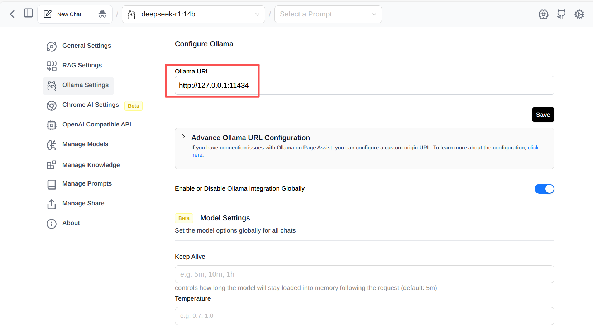
框出来的是Ollama模型调用的url。后续需要配置到框架里

## linux环境
如果是windows需要在windows商店装一个WSL

## python环境
安装miniconda做python环境隔离[https://www.anaconda.com/docs/getting-started/miniconda/main]
```
conda create env xxx 创建python环境xxx
conda activate xxx 切换到xxx的python环境
conda install xxx 在当前环境安装xxxpython包
```

## docker环境
需要装一个docker环境，windows可以装docker desktop

## fastgpt框架安装
参考[https://doc.fastgpt.cn/docs/introduction/development/quick-start]

### fastgpt可能遇到的问题
- pg容器起不来
    ```
    看pg容器的日志，可能是permission denied。需要修改docker-compose.yml中pg容器的配置,把vectorDB和aiproxy_pg两个服务的volumes中/postgresql/data 改成 postgresql/pgdata
    ```
    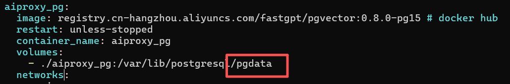
    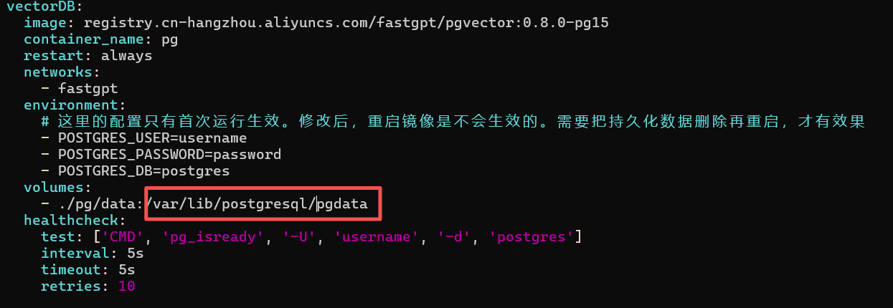

- mongo容器里mongodb起不来
    ```
    修改docker-compose.yml文件,把mongo服务的映射卷改成新建卷。
    ```
    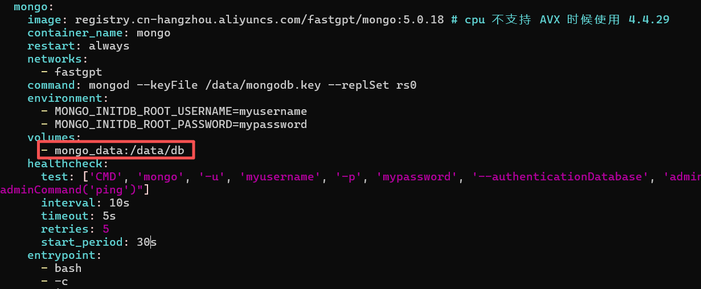
    ```
    yml文件末尾加上新建卷声明
    ```
    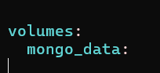

- mongo容器log里一直报错连不上
    ```
    根据mongo里的log自行搜索，目前遇到两个问题：
    1、配置里的用户（myusername,mypassword）没有自动创建：
       自己进到mongo容器里用db.createUser命令进行创建，记得创建时赋予root权限。
    2、mongo的集群模式没有初始化，没有选举出master节点：
       进到mongo容器里用rs.status()命令查看当前集群状态，如果没有初始化集群，需要手动执行下docker-compose.yml里的集群初始化脚本。然后重启mongo容器。执行的命令为
       mongo -u myusername -p mypassword --authenticationDatabase admin /data/initReplicaSet.js 
    ```
    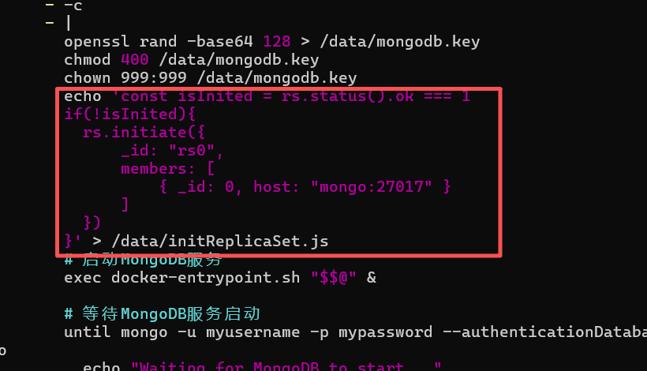

- 其他部署问题
    ```
    优先搜索fastgpt的github issue
    https://github.com/labring/FastGPT/issues
    ```


# DEMO运行部署
## DEMO组成部分
- 质量文件生成demo分为三部分组成（**后续考虑整合**）
    - fastgpt的Agent工作流——fastgpt框架
    - 后端api接口——提供prompt模板变更、知识树变更的api接口
    - 前端界面——前端界面

## Agent工作流部署
- 质量文件生成工作流：
    - 进入部署后的fastgpt网页，导入项目中的“质量文件审核”工作流json文件
    - 配置好fastgpt的相关LLM设置
    - 打开工作流界面，查看工作流中http请求是否正确，需手动修改到后端api的接口地址
    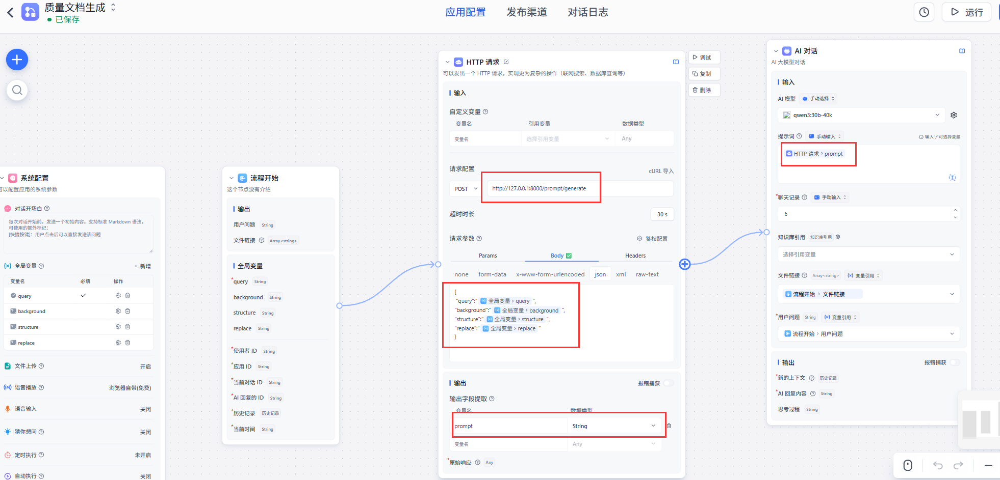
- 智能审核工作流
    - 智能审核工作流目前只有一个AI对话，可以自己新建一个工作流，然后点击```发布渠道```，用api发布，记住api的key，后面后端api配置需要填入
## 后端api部署
- 后端api代码在backends文件夹中，进入文件夹目录，在cmd窗口执行 
```uvicorn api:app --reload```指令。
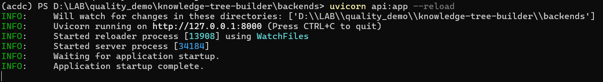
- 需要python环境依赖，在床架的conda环境中安装相关依赖
- 后端读取的是knowledge.json和template.json文件，可以自行修改knowledge.json中文档的位置。项目中目前已在backends文件夹里附带了两份MD文件，分别是GJB9001标准和不合格品控制标准。根据需要自行调整，也可以在前端界面调整。
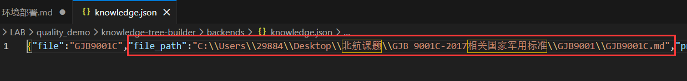
- 后端需要配置智能审核工作流的api配置。LLM_AUTH_TOKEN就是上面fastgpt的api key；LLM_APP_ID是fastgpt的会话ID，即fastgpt应用发布后，点击那个工作流引用，在url栏从'appId=?'得到appId。
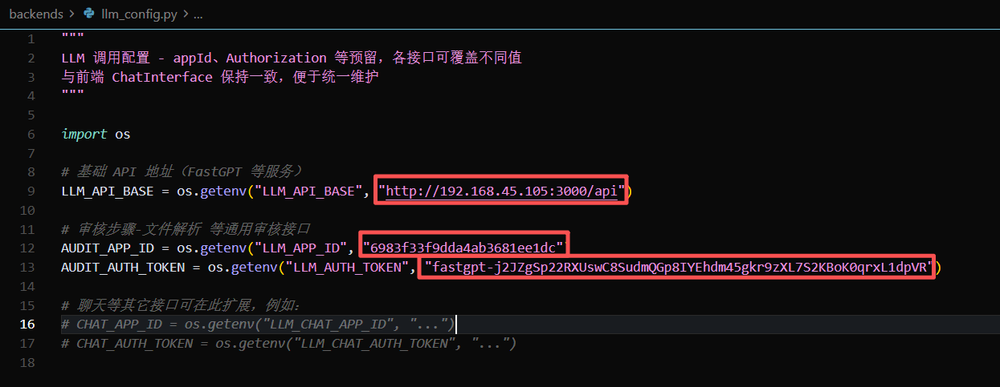

## 前端界面部署
- 安装依赖，执行```npm i```命令
- 修改配置的后端api地址和fastgpt agent工作流地址
以下图为例，localhost:3000是fastgpt agent工作流的地址；127.0.0.1:8000是后端api地址
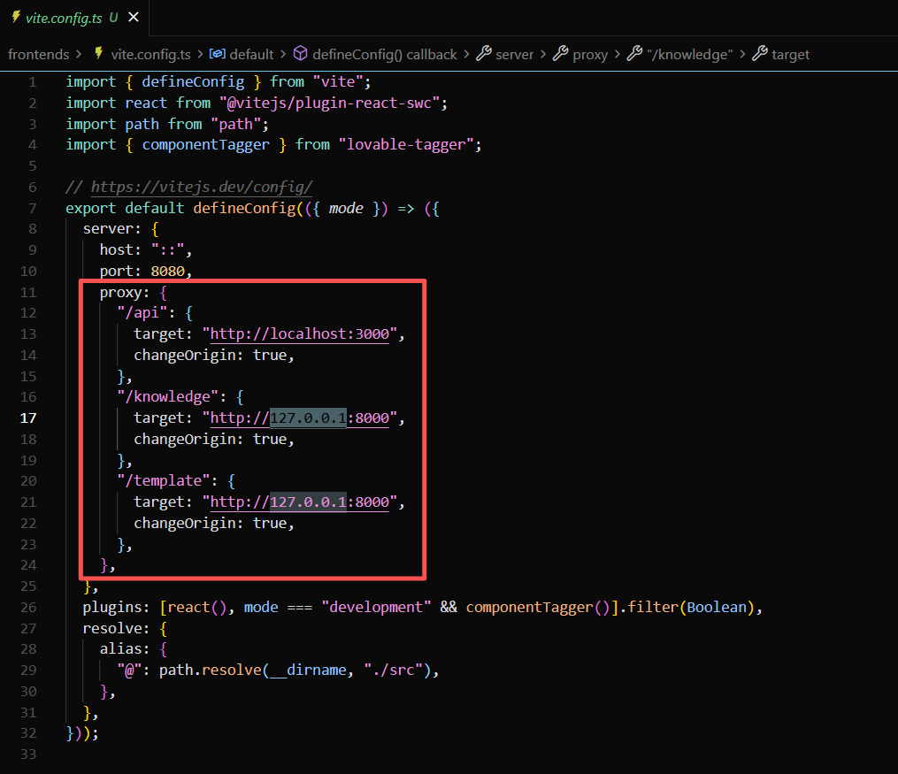
- 前端界面代码在knowledge-tree-builder文件夹中，在文件夹根目录，运行```npm run dev```指令，以dev模式运行，前端会运行在本地8080端口
